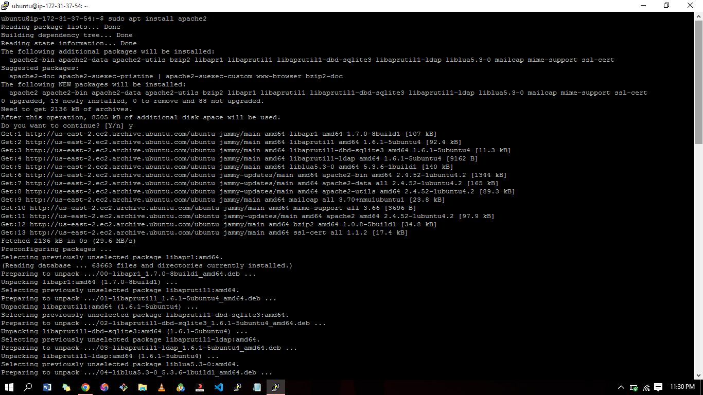
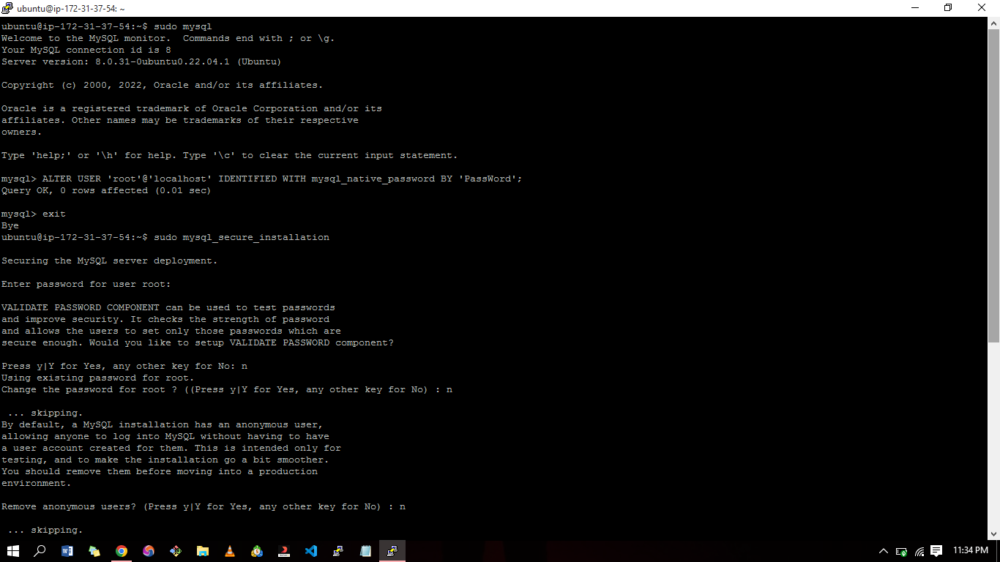
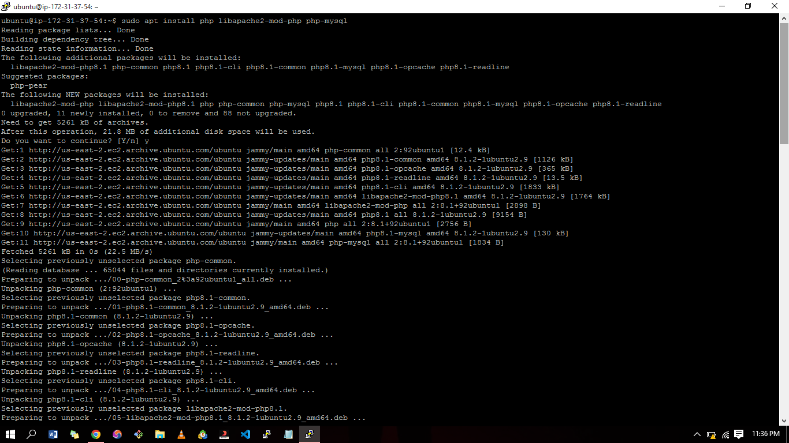
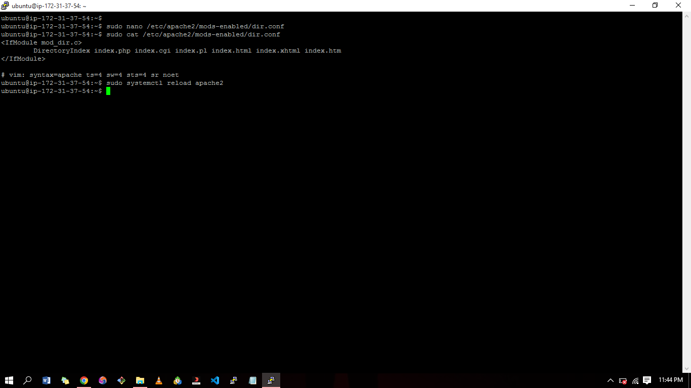
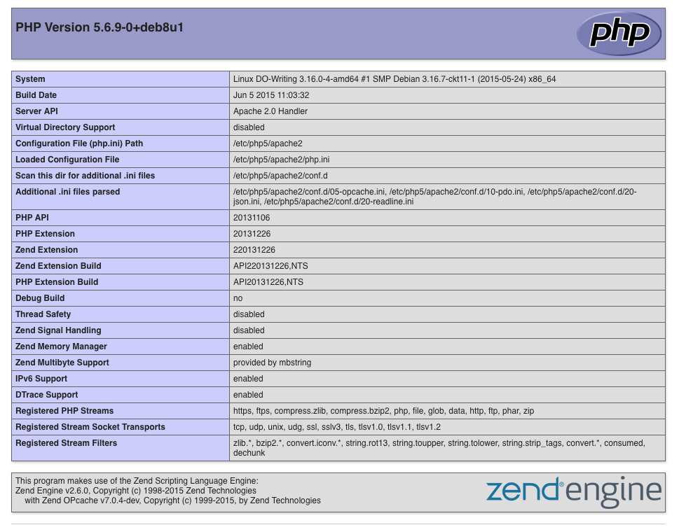

# LAMP STACK IMPLEMENTATION (Linux, Apache, MySQL and PHP)

## Prerequisites
- Cloud Service Provider - AWS, Azure, GCP, etc.
- Launch a Linux Instance (Ubuntu preferably).
- Priot knowledge on how to SSH into a virtual host.


## STEP 1 - IINSTALLING APACHE WEB SERVER

Install Apache using Ubuntu’s package manager  
`apt`

Update a list of packages in package manager  
`sudo apt update`

Run apache2 package installation  
`sudo apt install apache2`



To verify that apache2 is running as a Service in your OS, use following command  
`sudo systemctl status apache2`

To view the Apache default page,
Go to http://Public-IP-Address:80 in your browser


## STEP 2 — INSTALLING MYSQL

Again, use `apt` to acquire and install this software:  
`sudo apt install mysql-server`

When prompted, confirm installation by typing Y, and then ENTER.

When the installation is finished, log in to the MySQL console by typing:  
`sudo mysql`

This will connect to the MySQL server as the administrative database user root, which is inferred by the use of sudo when running this command.

Define the users password using this command  
`ALTER USER 'root'@'localhost' IDENTIFIED WITH mysql_native_password BY 'PassWord';`

Exit the MySQL shell with:  
`mysql> exit`

Start the interactive script by running:  
`sudo mysql_secure_installation`

This will ask if you want to configure the VALIDATE PASSWORD PLUGIN. 

 


## STEP 3 — INSTALLING PHP

In addition to the php package, you’ll need php-mysql, a PHP module that allows PHP to communicate with MySQL-based databases. You’ll also need libapache2-mod-php to enable Apache to handle PHP files. Core PHP packages will automatically be installed as dependencies.

To install these 3 packages at once, run:  
`sudo apt install php libapache2-mod-php php-mysql`
  


## STEP 4 — CREATING A VIRTUAL HOST FOR YOUR WEBSITE USING APACHE

Create the directory for 'newproject' using `mkdir` command as follows:  
`sudo mkdir /var/www/newproject`

Next, assign ownership of the directory with your current system user:  
`sudo chown -R $USER:$USER /var/www/newproject`

Create and open a new configuration file in Apache’s sites-available directory using:  
`sudo nano /etc/apache2/sites-available/newproject.conf`

Paste in the following bare-bones configuration
```
<VirtualHost *:80>
ServerName newproject
ServerAlias www.newproject
ServerAdmin webmaster@localhost
DocumentRoot /var/www/newproject
ErrorLog ${APACHE_LOG_DIR}/error.log
CustomLog ${APACHE_LOG_DIR}/access.log combined
</VirtualHost>
```
  
Use `a2ensite` command to enable the new virtual host:  
`sudo a2ensite newproject`
  
To disable Apache’s default website use `a2dissite` command, type:  
`sudo a2dissite 000-default`

To make sure your configuration file doesn’t contain syntax errors, run:  
`sudo apache2ctl configtest`

Reload Apache so these changes take effect:  
`sudo systemctl reload apache2`


## STEP 5 — ENABLE PHP ON THE WEBSITE

With the default DirectoryIndex settings on Apache, a file named index.html will always take precedence over an index.php file.

In case you want to change this behavior, you’ll need to edit the /etc/apache2/mods-enabled/dir.conf file and change the order in which the index.php file is listed within the DirectoryIndex directive:

`sudo nano /etc/apache2/mods-enabled/dir.conf`

```
<IfModule mod_dir.c>
#Change this:
#DirectoryIndex index.html index.cgi index.pl index.php index.xhtml index.htm
#To this:
DirectoryIndex index.php index.html index.cgi index.pl index.xhtml index.htm
</IfModule>
```
Save and close the file, reload Apache so the changes take effect:

`sudo systemctl reload apache2`



**To verify if this works,**
- Create a PHP script to test that PHP is correctly installed and configured on your server.
- Create a new file named index.php inside your custom web root folder:
`nano /var/www/newproject/index.php`
This will open a blank file. Add the following text, which is valid PHP code, inside the file:
```
<?php
phpinfo();
```
When you are finished, save and close the file, refresh the page and you will see a page similar to this:


