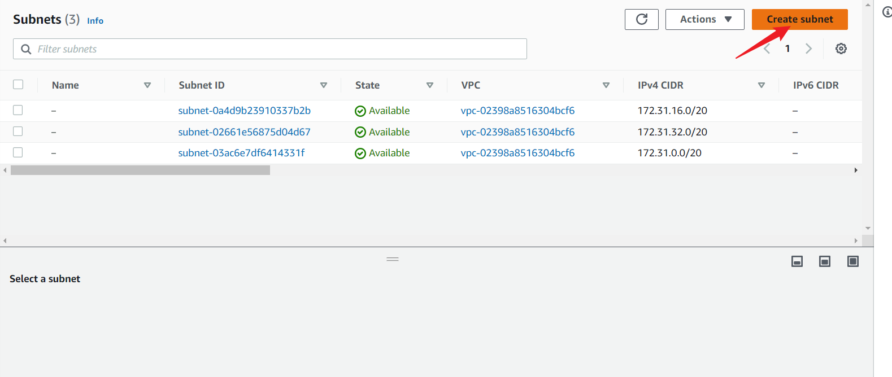
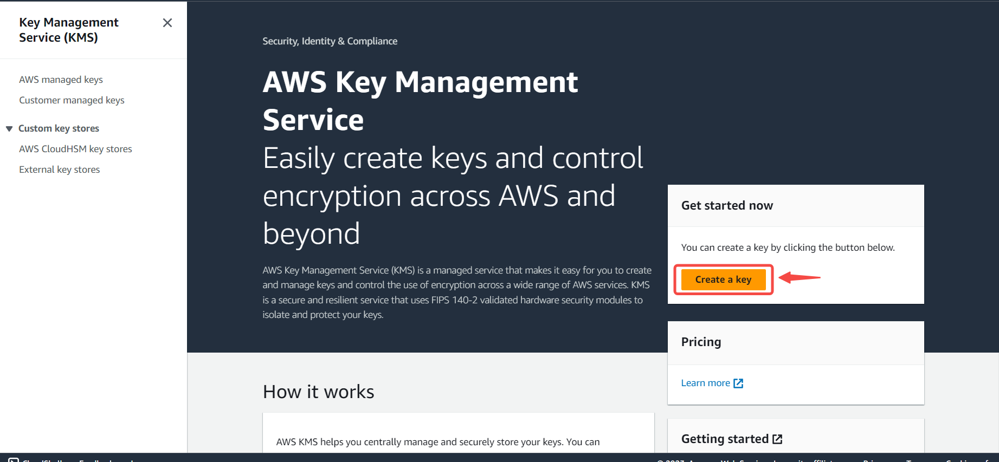

# AWS CLOUD SOLUTION FOR 2 COMPANY WEBSITES USING A REVERSE PROXY TECHNOLOGY

## General Overview

You will build a secure infrastructure inside AWS VPC (Virtual Private Cloud) network for a fictitious company named WakaBetter. that uses WordPress CMS for its main business website, and a [Tooling Website](https://github.com/IwunzeGE/tooling) for their DevOps team. As part of the company’s desire for improved security and performance, a decision has been made to use a reverse proxy technology from NGINX to achieve this.
Cost, Security, and Scalability are the major requirements for this project. Hence, implementing the architecture designed below, ensure that infrastructure for both websites, WordPress and Tooling, is resilient to Web Server’s failures, can accomodate to increased traffic and, at the same time, has reasonable cost.

## Requirements

### There are few requirements that must be met before you begin:

- Properly configure your AWS account and Organization Unit Watch How To Do This Here
    - Create an AWS Master account. (Also known as Root Account)
    - Within the Root account, create a sub-account and name it DevOps. (You will need another email address to complete this)
    
    
    
    
    - Within the Root account, create an AWS Organization Unit (OU). Name it Dev. (We will launch Dev resources in there).
   
   
    - Move the DevOps account into the Dev OU.
   
   
   
    - Login to the newly created AWS account using the new email address.
    
    **Note:** If you can't find your password, Just do a password reset from the console.
- Create a domain name for your company. I used [namecheap](www.namecheap.com).
- Create a hosted zone in AWS, and map it to your domain.

## SET UP A VIRTUAL PRIVATE NETWORK (VPC)

1. Create a VPC

2. Enable DNS hosting

3. Create internet gateway as shown in the architecture

4. Create the subnets

Use this website to get the CIDR blocks easily. [ipinfo](https://ipinfo.io/ips).

5. Create a route tables and associate it with private and public subnets.

6. Edit a route in public route table, and associate it with the Internet Gateway. (This is what allows a public subnet to be accessisble from the Internet).

7. Create 3 Elastic IPs

8. Create a Nat Gateway and assign one of the Elastic IPs (*The other 2 will be used by Bastion hosts)

9. Create a Security Group for:

- Application Load Balancer: ALB will be available from the Internet.

- Bastion Servers: Access to the Bastion servers should be allowed only from workstations that need to SSH into the bastion servers. Hence, you can use your workstation public IP address.

- Nginx Servers: Access to Nginx should only be allowed from a Application Load balancer (ALB).

- Internal Application Load Balancer: ALB will be available from the Nginx servers.

- Webservers: Access to Webservers should only be allowed from the Internal Application Load Balancer.

- Data Layer: Access to the Data layer, which is comprised of Amazon Relational Database Service (RDS) and Amazon Elastic File System (EFS) must be carefully desinged – only webservers should be able to connect to RDS, while Nginx and Webservers will have access to EFS Mountpoint.

## TLS Certificates From Amazon Certificate Manager (ACM)
You will need TLS certificates to handle secured connectivity to your Application Load Balancers (ALB).

- Navigate to AWS ACM

- Request a public wildcard certificate for the domain name you registered.

- Use DNS to validate the domain name

## Configure EFS
- Create a new EFS File system. Create an EFS mount target per AZ in the VPC, associate it with both subnets dedicated for data layer. Associate the Security groups created earlier for data layer.

- Create 2 access points - ! for each of the website (wordpress and tooling) so that the files do not overwrite each other when we mount.

## Configure RDS
### Pre-requisite: 
- Create a KMS Key

To ensure that yout databases are highly available and also have failover support in case one availability zone fails, we will configure a multi-AZ set up of RDS MySQL database instance. In our case, since we are only using 2 AZs, we can only failover to one, but the same concept applies to 3 Availability Zones.

To configure RDS, follow steps below:
1. Create a subnet group and add 2 private subnets (data Layer)

2. Create the DB

### Configure Loadbalancers and Target Groups

1. Create Target group for NGINX, tooling amd wordpress targets

NB: I didn't add any instance to the targets because I havent laucnhed them. I'll do that kater in and add them to the target group.

1. Create public-facing and internal loadbalancers

Repeat the same procedure for internal ALB, select wordpress as the default target and create a rule to send traffic to tooling if the headers match our specified parameters.

