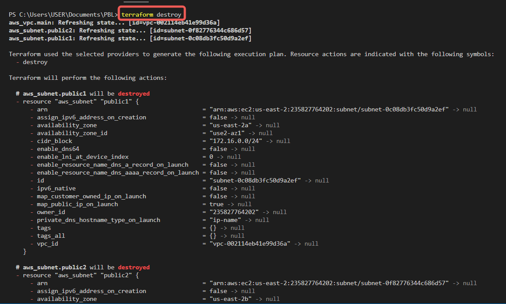
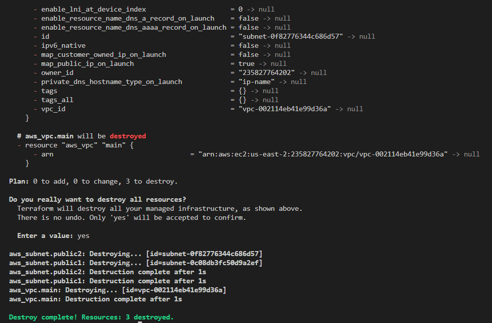
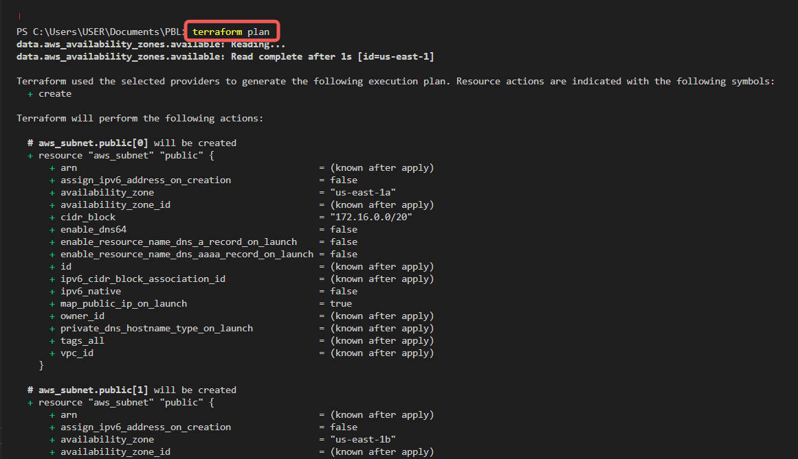
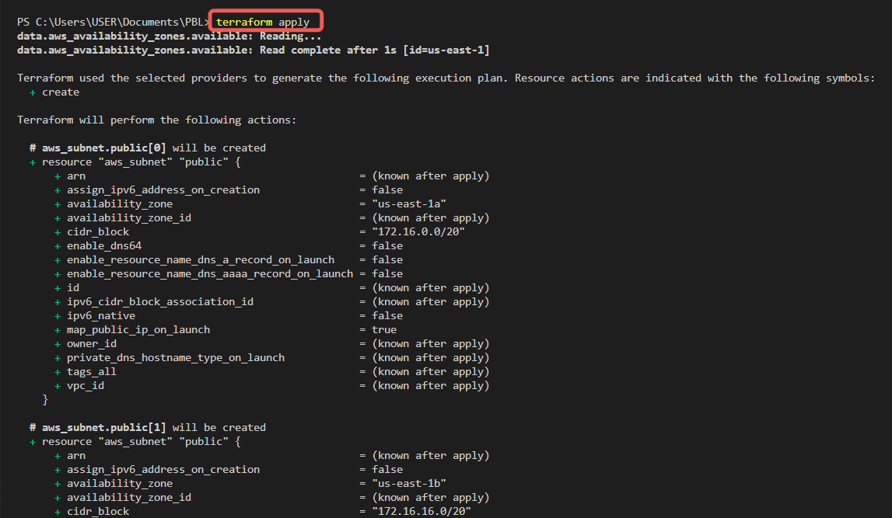
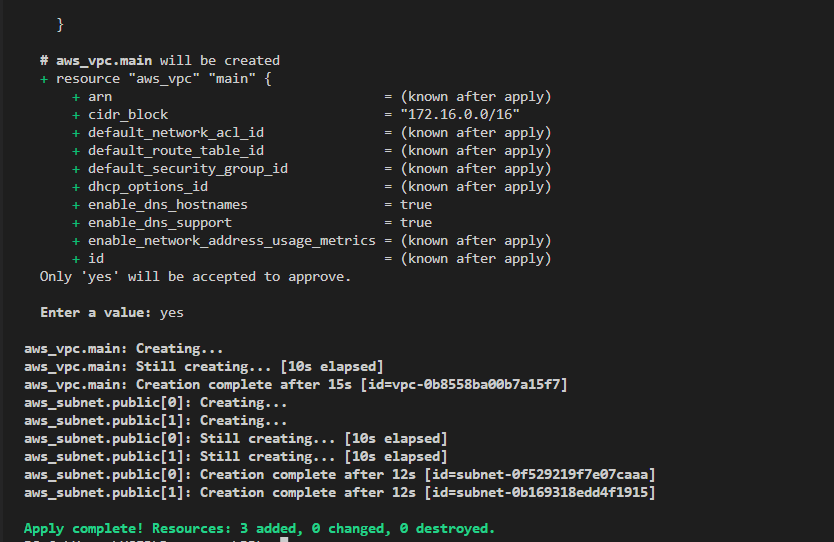

# AUTOMATE INFRASTRUCTURE WITH IAC USING TERRAFORM PART 1

In Project 15 earlier, The below architecture was provisioned manually using the AWS Console.


## Prerequisites

- You must have completed Terraform fundamental course.
- Create an IAM user, name it terraform (ensure that the user has only programatic access to your AWS account) and grant this user AdministratorAccess permissions.
- Copy the secret access key and access key ID. Save them in a notepad temporarily.
- Configure programmatic access from your workstation to connect to AWS using the access keys copied above and a Python SDK (boto3). You must have Python 3.6 or higher on your workstation.
If you are on Windows, use gitbash, if you are on a Mac, you can simply open a terminal. Read here to configure the Python SDK properly.

- Run `pip install boto3`


- For easier authentication configuration – use AWS CLI with `aws configure` command.


- Create an S3 bucket to store Terraform state file. You can name it something like `<yourname>-dev-terraform-bucket`.


**(Note: S3 bucket names must be unique unique within a region partition, you can read about S3 bucken naming in this article)**. We will use this bucket from Project-17 onwards.

- When you have configured authentication and installed boto3, make sure you can programmatically access your AWS account by running following commands.

`python`  

```python
import boto3
s3 = boto3.resource('s3')
for bucket in s3.buckets.all():
    print(bucket.name)
```


- Install Terraform. Check the official installation [documentation](https://developer.hashicorp.com/terraform/tutorials/aws-get-started/install-cli#install-terraform). 

For Windows,
- Open `Powershell` in admin mode.
- Run `choco install terraform`.

**Note: You must have `Chocolatey` previously installed.**

## VPC | Subnets | Security Groups

### Create a directory structure
NB: I'd be using Visual Studio Code IDE.
- Create a folder called `PBL`
- Create a file in the folder, name it `main.tf`

- Add AWS as a provider, and a resource to create a VPC in the `main.tf` file. The provider block informs Terraform that we intend to build infrastructure within AWS.

- Resource block will create a VPC.
```python
provider "aws" {
  region = "eu-central-1"
}

# Create VPC
resource "aws_vpc" "main" {
  cidr_block                     = "172.16.0.0/16"
  enable_dns_support             = "true"
  enable_dns_hostnames           = "true"
}
```
**Note: You can change the configuration above to create your VPC in other region that is closer to you. The same applies to all configuration snippets that will follow.**

- Download necessary plugins for Terraform to work. These plugins are used by providers and provisioners. At this stage, we only have provider in our `main.tf` file. So, Terraform will just download plugin for AWS provider. 
Accomplish this with `terraform init` command as seen in the below demonstration.


- Ccreate the only resource we just defined. `aws_vpc`. But before we do that, we should check to see what terraform intends to create before we tell it to go ahead and create it.
Run `terraform plan`.


- If you are happy with changes planned, execute `terraform apply`.


## Subnets resource section

According to the architectural design, we require 6 subnets:

- 2 public
- 2 private for webservers
- 2 private for data layer

Let us create the first 2 public subnets. Add below configuration to the `main.tf` file:

```python
# Create public subnets1
    resource "aws_subnet" "public1" {
    vpc_id                     = aws_vpc.main.id
    cidr_block                 = "172.16.0.0/24"
    map_public_ip_on_launch    = true
    availability_zone          = "eu-central-1a"


}


# Create public subnet2
    resource "aws_subnet" "public2" {
    vpc_id                     = aws_vpc.main.id
    cidr_block                 = "172.16.1.0/24"
    map_public_ip_on_launch    = true
    availability_zone          = "eu-central-1b"
}
```

We are creating 2 subnets, therefore declaring 2 resource blocks – one for each of the subnets. We are using the vpc_id argument to interpolate the value of the VPC id by setting it to aws_vpc.main.id. This way, Terraform knows inside which VPC to create the subnet.

Run `terraform plan` and `terraform apply`.

### Observations:

- Hard coded values: Remember our best practice hint from the beginning? Both the availability_zone and cidr_block arguments are hard coded. We should always endeavour to make our work dynamic.
- Multiple Resource Blocks: Notice that we have declared multiple resource blocks for each subnet in the code. This is bad coding practice. We need to create a single resource block that can dynamically create resources without specifying multiple blocks. Imagine if we wanted to create 10 subnets, our code would look very clumsy. So, we need to optimize this by introducing a count argument.

Now let us improve our code by refactoring it.

First, destroy the current infrastructure. Since we are still in development, this is totally fine. Otherwise, DO NOT DESTROY an infrastructure that has been deployed to production.
To destroy whatever has been created run `terraform destroy` command, and type `yes` after evaluating the plan.





## Fixing The Problems By Code Refactoring

- Fixing Hard Coded Values: We will introduce variables, and remove hard coding.

Starting with the provider block, declare a variable named region, give it a default value, and update the provider section by referring to the declared variable.

```python
    variable "region" {
        default = "eu-central-1"
    }


    provider "aws" {
        region = var.region
    }
Do the same to cidr value in the vpc block, and all the other arguments.
    variable "region" {
        default = "eu-central-1"
    }


    variable "vpc_cidr" {
        default = "172.16.0.0/16"
    }


    variable "enable_dns_support" {
        default = "true"
    }


    variable "enable_dns_hostnames" {
        default ="true" 
    }

    provider "aws" {
    region = var.region
    }


    # Create VPC
    resource "aws_vpc" "main" {
    cidr_block                     = var.vpc_cidr
    enable_dns_support             = var.enable_dns_support 
    enable_dns_hostnames           = var.enable_dns_support
    enable_classiclink             = var.enable_classiclink
    enable_classiclink_dns_support = var.enable_classiclink

    }
```

### Taking a Dive at Loops & Data sources

Terraform has a functionality that allows us to pull data which exposes information to us. For example, every region has Availability Zones (AZ). Different regions have from 2 to 4 Availability Zones. With over 20 geographic regions and over 70 AZs served by AWS, it is impossible to keep up with the latest information by hard coding the names of AZs. Hence, we will explore the use of Terraform’s Data Sources to fetch information outside of Terraform. In this case, from AWS.
Let us fetch Availability zones from AWS, and replace the hard coded value in the subnet’s availability_zone section.

```python
        # Get list of availability zones
        data "aws_availability_zones" "available" {
        state = "available"
        }
```

To make use of this new data resource, we will need to introduce a count argument in the subnet block: Something like this.

```python
    # Create public subnet1
    resource "aws_subnet" "public" { 
        count                   = 2
        vpc_id                  = aws_vpc.main.id
        cidr_block              = "172.16.1.0/24"
        map_public_ip_on_launch = true
        availability_zone       = data.aws_availability_zones.available.names[count.index]
    }
```

But we still have a problem. If we run Terraform with this configuration, it may succeed for the first time, but by the time it goes into the second loop, it will fail because we still have cidr_block hard coded. The same cidr_block cannot be created twice within the same VPC. So, we have a little more work to do.
Let’s make cidr_block dynamic.
We will introduce a function `cidrsubnet()` to make this happen. It accepts 3 parameters. Let us use it first by updating the configuration, then we will explore its internals.

```python
    # Create public subnet1
    resource "aws_subnet" "public" { 
        count                   = 2
        vpc_id                  = aws_vpc.main.id
        cidr_block              = cidrsubnet(var.vpc_cidr, 4 , count.index)
        map_public_ip_on_launch = true
        availability_zone       = data.aws_availability_zones.available.names[count.index]
    }
```

A closer look at cidrsubnet – this function works like an algorithm to dynamically create a subnet CIDR per AZ. Regardless of the number of subnets created, it takes care of the cidr value per subnet. Its parameters are cidrsubnet(prefix, newbits, netnum).

- The prefix parameter must be given in CIDR notation, same as for VPC.
- The newbits parameter is the number of additional bits with which to extend the prefix. For example, if given a prefix ending with /16 and a newbits value of 4, the resulting subnet address will have length /20
- The netnum parameter is a whole number that can be represented as a binary integer with no more than newbits binary digits, which will be used to populate the additional bits added to the prefix


**NOTE:** You can experiment how this works by entering the terraform console and keep changing the figures to see the output.
- On the terminal, run `terraform console`
- type `cidrsubnet("172.16.0.0/16", 4, 0)`
- Hit `enter`.
- See the output.
- Keep changing the numbers and see what happens.
- To get out of the console, type exit.


The final problem to solve is removing hard coded count value.

If we cannot hard code a value we want, then we will need a way to dynamically provide the value based on some input. Since the data resource returns all the AZs within a region, it makes sense to count the number of AZs returned and pass that number to the count argument.
To do this, we can introuduce length() function, which basically determines the length of a given list, map, or string.
Since `data.aws_availability_zones.available.names` returns a list like `["eu-central-1a", "eu-central-1b", "eu-central-1c"]` we can pass it into a `lenght` function and get number of the AZs.

`length(["eu-central-1a", "eu-central-1b", "eu-central-1c"])`

Now we can simply update the public subnet block like this

```python
# Create public subnet1
    resource "aws_subnet" "public" { 
        count                   = length(data.aws_availability_zones.available.names)
        vpc_id                  = aws_vpc.main.id
        cidr_block              = cidrsubnet(var.vpc_cidr, 4 , count.index)
        map_public_ip_on_launch = true
        availability_zone       = data.aws_availability_zones.available.names[count.index]
    }
```

### Observations:
What we have now, is sufficient to create the subnet resource required. But if you observe, it is not satisfying our business requirement of just 2 subnets. The length function will return number 3 to the count argument, but what we actually need is 2.
Now, let us fix this.
Declare a variable to store the desired number of public subnets, and set the default value.

```python
variable "preferred_number_of_public_subnets" {
  default = 2
}
```

Next, update the count argument with a condition. Terraform needs to check first if there is a desired number of subnets. Otherwise, use the data returned by the lenght function. See how that is presented below.

```python
# Create public subnets
resource "aws_subnet" "public" {
  count  = var.preferred_number_of_public_subnets == null ? length(data.aws_availability_zones.available.names) : var.preferred_number_of_public_subnets   
  vpc_id = aws_vpc.main.id
  cidr_block              = cidrsubnet(var.vpc_cidr, 4 , count.index)
  map_public_ip_on_launch = true
  availability_zone       = data.aws_availability_zones.available.names[count.index]
}
```

Now lets break it down:

- The first part `var.preferred_number_of_public_subnets == null` checks if the value of the variable is set to null or has some value defined.
- The second part `?` and `length(data.aws_availability_zones.available.names)` means, if the first part is true, then use this. In other words, if preferred number of public subnets is null (Or not known) then set the value to the data returned by lenght function.
- The third part : and `var.preferred_number_of_public_subnets` means, if the first condition is false, i.e preferred number of public subnets is not null then set the value to whatever is definied in `var.preferred_number_of_public_subnets`
Now the entire configuration should now look like this

```python
# Get list of availability zones
data "aws_availability_zones" "available" {
state = "available"
}


variable "region" {
      default = "eu-central-1"
}


variable "vpc_cidr" {
    default = "172.16.0.0/16"
}


variable "enable_dns_support" {
    default = "true"
}


variable "enable_dns_hostnames" {
    default ="true" 
}


variable "enable_classiclink" {
    default = "false"
}


variable "enable_classiclink_dns_support" {
    default = "false"
}


  variable "preferred_number_of_public_subnets" {
      default = 2
}


provider "aws" {
  region = var.region
}


# Create VPC
resource "aws_vpc" "main" {
  cidr_block                     = var.vpc_cidr
  enable_dns_support             = var.enable_dns_support 
  enable_dns_hostnames           = var.enable_dns_support
  enable_classiclink             = var.enable_classiclink
  enable_classiclink_dns_support = var.enable_classiclink


}


# Create public subnets
resource "aws_subnet" "public" {
  count  = var.preferred_number_of_public_subnets == null ? length(data.aws_availability_zones.available.names) : var.preferred_number_of_public_subnets   
  vpc_id = aws_vpc.main.id
  cidr_block              = cidrsubnet(var.vpc_cidr, 4 , count.index)
  map_public_ip_on_launch = true
  availability_zone       = data.aws_availability_zones.available.names[count.index]


}
```

## Introducing variables.tf & terraform.tfvars

Instead of havng a long list of variables in `main.tf` file, we can actually make our code a lot more readable and better structured by moving out some parts of the configuration content to other files. We will put all variable declarations in a separate file and provide non default values to each of them.

- Create a new file and name it `variables.tf`. Copy all the variable declarations into the new file.
- Create another file, name it `terraform.tfvars`. Set values for each of the variables.

### main.tf

```python
# Get list of availability zones
data "aws_availability_zones" "available" {
state = "available"
}


provider "aws" {
  region = var.region
}


# Create VPC
resource "aws_vpc" "main" {
  cidr_block                     = var.vpc_cidr
  enable_dns_support             = var.enable_dns_support 
  enable_dns_hostnames           = var.enable_dns_support
  enable_classiclink             = var.enable_classiclink
  enable_classiclink_dns_support = var.enable_classiclink


}


# Create public subnets
resource "aws_subnet" "public" {
  count  = var.preferred_number_of_public_subnets == null ? length(data.aws_availability_zones.available.names) : var.preferred_number_of_public_subnets   
  vpc_id = aws_vpc.main.id
  cidr_block              = cidrsubnet(var.vpc_cidr, 4 , count.index)
  map_public_ip_on_launch = true
  availability_zone       = data.aws_availability_zones.available.names[count.index]
}
```

### variables.tf

```python
variable "region" {
      default = "eu-central-1"
}


variable "vpc_cidr" {
    default = "172.16.0.0/16"
}


variable "enable_dns_support" {
    default = "true"
}


variable "enable_dns_hostnames" {
    default ="true" 
}


variable "enable_classiclink" {
    default = "false"
}


variable "enable_classiclink_dns_support" {
    default = "false"
}


  variable "preferred_number_of_public_subnets" {
      default = null
}
```

### terraform.tfvars

```python
region = "eu-central-1"


vpc_cidr = "172.16.0.0/16" 


enable_dns_support = "true" 


enable_dns_hostnames = "true"  


enable_classiclink = "false" 


enable_classiclink_dns_support = "false" 


preferred_number_of_public_subnets = 2
```

You should also have this file structure in the PBL folder.

.

- Run `terraform plan` and `terraform apply` and ensure everything works.






