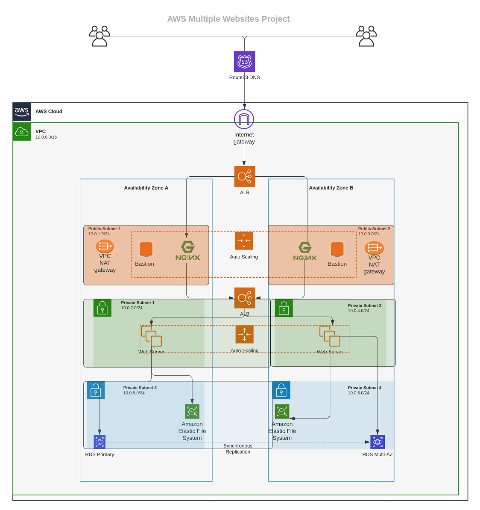

# AUTOMATE INFRASTRUCTURE WITH IAC USING TERRAFORM PART 1

In Porject 15 earlier, The below architecture was provisioned manually using the AWS Console.



## Prerequisites

- You must have completed Terraform fundamental course.
- Create an IAM user, name it terraform (ensure that the user has only programatic access to your AWS account) and grant this user AdministratorAccess permissions.
- Copy the secret access key and access key ID. Save them in a notepad temporarily.
- Configure programmatic access from your workstation to connect to AWS using the access keys copied above and a Python SDK (boto3). You must have Python 3.6 or higher on your workstation.
If you are on Windows, use gitbash, if you are on a Mac, you can simply open a terminal. Read here to configure the Python SDK properly.
- For easier authentication configuration – use AWS CLI with `aws configure` command.


- Create an S3 bucket to store Terraform state file. You can name it something like `<yourname>-dev-terraform-bucket`.


**(Note: S3 bucket names must be unique unique within a region partition, you can read about S3 bucken naming in this article)**. We will use this bucket from Project-17 onwards.

- When you have configured authentication and installed boto3, make sure you can programmatically access your AWS account by running following commands in  

`python`  

```python
import boto3
s3 = boto3.resource('s3')
for bucket in s3.buckets.all():
    print(bucket.name)
```

