# AUTOMATE INFRASTRUCTURE WITH IAC USING TERRAFORM PART 2

## Networking - Private subnets & best practices

- Create 4 private subnets keeping in mind following principles:

    - Make sure you use variables or length() function to determine the number of AZs.
    - Use variables and cidrsubnet() function to allocate vpc_cidr for subnets.
    - Keep variables and resources in separate files for better code structure and readability.
    - Tags all the resources you have created so far. Explore how to use `format()` and `count` functions to automatically tag subnets with its respective number.

**Note:** You can add multiple tags as a default set. for example, in out `terraform.tfvars` file we can have default tags defined.

```
tags = {
  Enviroment      = "production" 
  Owner-Email     = "dare@darey.io"
  Managed-By      = "Terraform"
  Billing-Account = "1234567890"
}
```
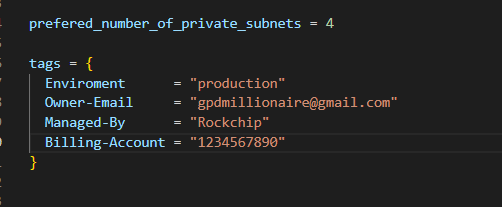


Now you can tag all you resources using the format below

```
tags = merge(
    var.tags,
    {
      Name = "Name of the resource"
    },
  )
```
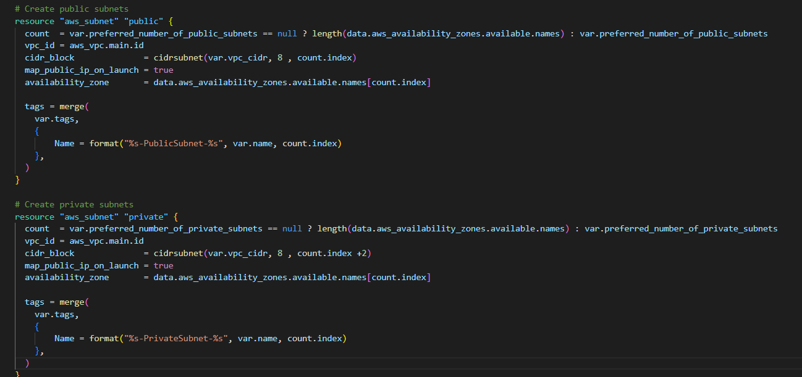

**NOTE:** Update the `variables.tf` to declare the variable tags used in the format above;

```
variable "tags" {
  description = "A mapping of tags to assign to all resources."
  type        = map(string)
  default     = {}
}
```
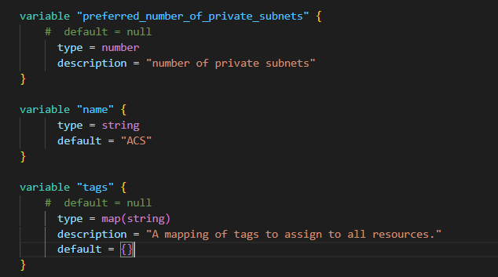

Anytime we need to make a change to the tags, we simply do that in one single place `(terraform.tfvars)`. But, our key-value pairs are hard coded. So, go ahead and work out a fix for that. Simply create variables for each value and use var.variable_name as the value to each of the keys.

## Internet Gateways & format() function

- Create an Internet Gateway in a separate Terraform file `internet_gateway.tf`

```python
resource "aws_internet_gateway" "ig" {
  vpc_id = aws_vpc.main.id


  tags = merge(
    var.tags,
    {
      Name = format("%s-%s!", aws_vpc.main.id,"IG")
    } 
  )
}
```

The `format()` functionis used to dynamically generate a unique name for this resource? The first part of the `%s` takes the interpolated value of `aws_vpc.main.id` while the second `%s` appends a literal string `IG` and finally an exclamation mark is added in the end. If any of the resources being created is either using the `count` function, or creating multiple resources using a loop, then a key-value pair that needs to be unique must be handled differently.
For example, each of our subnets should have a unique name in the tag section. Without the `format()` function, we would not be able to see uniqueness. With the format function, each private subnet’s tag will look like this.

```
Name = PrvateSubnet-0
Name = PrvateSubnet-1
Name = PrvateSubnet-2
```

Lets try and see that in action.

```python
  tags = merge(
    var.tags,
    {
      Name = format("PrivateSubnet-%s", count.index)
    } 
  )
```

## NAT Gateways

- Create 1 NAT Gateways and 1 Elastic IP (EIP) addresses

    - Create the NAT Gateways in a new file called `natgateway.tf`.

**Note:** We need to create an Elastic IP for the NAT Gateway, and you can see the use of depends_on to indicate that the Internet Gateway resource must be available before this should be created. Although Terraform does a good job to manage dependencies, but in some cases, it is good to be explicit.
You can read more on dependencies [here](https://www.terraform.io/docs/language/meta-arguments/depends_on.html)

```python
resource "aws_eip" "nat_eip" {
  vpc        = true
  depends_on = [aws_internet_gateway.ig]


  tags = merge(
    var.tags,
    {
      Name = format("%s-EIP", var.name)
    },
  )
}


resource "aws_nat_gateway" "nat" {
  allocation_id = aws_eip.nat_eip.id
  subnet_id     = element(aws_subnet.public.*.id, 0)
  depends_on    = [aws_internet_gateway.ig]


  tags = merge(
    var.tags,
    {
      Name = format("%s-Nat", var.name)
    },
  )
}
```

## AWS Routes

- Create a file called `route_tables.tf` and use it to create routes for both public and private subnets, create the below resources. Ensure they are properly tagged.
    - aws_route_table
    - aws_route
    - aws_route_table_association

```python    
# create private route table
resource "aws_route_table" "private-rtb" {
  vpc_id = aws_vpc.main.id


  tags = merge(
    var.tags,
    {
      Name = format("%s-Private-Route-Table", var.name)
    },
  )
}

# associate all private subnets to the private route table
resource "aws_route_table_association" "private-subnets-assoc" {
  count          = length(aws_subnet.private[*].id)
  subnet_id      = element(aws_subnet.private[*].id, count.index)
  route_table_id = aws_route_table.private-rtb.id
}


# create route table for the public subnets
resource "aws_route_table" "public-rtb" {
  vpc_id = aws_vpc.main.id


  tags = merge(
    var.tags,
    {
      Name = format("%s-Public-Route-Table", var.name)
    },
  )
}


# create route for the public route table and attach the internet gateway
resource "aws_route" "public-rtb-route" {
  route_table_id         = aws_route_table.public-rtb.id
  destination_cidr_block = "0.0.0.0/0"
  gateway_id             = aws_internet_gateway.ig.id
}


# associate all public subnets to the public route table
resource "aws_route_table_association" "public-subnets-assoc" {
  count          = length(aws_subnet.public[*].id)
  subnet_id      = element(aws_subnet.public[*].id, count.index)
  route_table_id = aws_route_table.public-rtb.id
}
```

Now if you run `terraform plan` and `terraform apply` it will add the following resources to AWS in multi-az set up:

```
– Our main vpc
– 2 Public subnets
– 4 Private subnets
– 1 Internet Gateway
– 1 NAT Gateway
– 1 EIP
– 2 Route tables
```
Now, we are done with Networking part of AWS set up, let us move on to Compute and Access Control configuration automation using Terraform!

## IaM and Roles

Lets pass an IAM role our EC2 instances to give them access to some specific resources, so we need to do the following:

1. Create `AssumeRole` : Assume Role uses Security Token Service (STS) API that returns a set of temporary security credentials that you can use to access AWS resources that you might not normally have access to. These temporary credentials consist of an access key ID, a secret access key, and a security token. Typically, you use AssumeRole within your account or for cross-account access.

- Add the following code to a new file named `roles.tf`

```python
resource "aws_iam_role" "ec2_instance_role" {
name = "ec2_instance_role"
  assume_role_policy = jsonencode({
    Version = "2012-10-17"
    Statement = [
      {
        Action = "sts:AssumeRole"
        Effect = "Allow"
        Sid    = ""
        Principal = {
          Service = "ec2.amazonaws.com"
        }
      },
    ]
  })


  tags = merge(
    var.tags,
    {
      Name = "aws assume role"
    },
  )
}
```

In above code we are creating `AssumeRole` with `AssumeRole policy`. It is granting EC2, permissions to assume the role.

2. Create `IAM policy` for this role: This is where we need to define a required policy (i.e., permissions) according to our requirements. For example, allowing an IAM role to perform action describe applied to EC2 instances:

```python
resource "aws_iam_policy" "policy" {
  name        = "ec2_instance_policy"
  description = "A test policy"
  policy = jsonencode({
    Version = "2012-10-17"
    Statement = [
      {
        Action = [
          "ec2:Describe*",
        ]
        Effect   = "Allow"
        Resource = "*"
      },
    ]


  })


  tags = merge(
    var.tags,
    {
      Name =  "aws assume policy"
    },
  )


}
```

3. Attach the Policy to the IAM Role: This is where, we will be attaching the policy which we created above, to the role we created in the first step.

```python
    resource "aws_iam_role_policy_attachment" "test-attach" {
        role       = aws_iam_role.ec2_instance_role.name
        policy_arn = aws_iam_policy.policy.arn
    }

#Create an Instance Profile and interpolate the IAM Role
    resource "aws_iam_instance_profile" "ip" {
        name = "aws_instance_profile_test"
        role =  aws_iam_role.ec2_instance_role.name
    }
```

## Create Secuirity Groups

- Create all the security groups in a single file, then we are going to refrence this security group within each resources that needs it.
IMPORTANT:
Check out the terraform documentation for [security group](https://registry.terraform.io/providers/hashicorp/aws/latest/docs/resources/security_group)
Check out the terraform documentation for [security group rule](https://registry.terraform.io/providers/hashicorp/aws/latest/docs/resources/security_group_rule)

Create a file and name it `security.tf`, copy and paste the code below

```python
# security group for alb, to allow acess from any where for HTTP and HTTPS traffic
resource "aws_security_group" "ext-alb-sg" {
  name        = "ext-alb-sg"
  vpc_id      = aws_vpc.main.id
  description = "Allow TLS inbound traffic"


  ingress {
    description = "HTTP"
    from_port   = 80
    to_port     = 80
    protocol    = "tcp"
    cidr_blocks = ["0.0.0.0/0"]
  }


  ingress {
    description = "HTTPS"
    from_port   = 22
    to_port     = 22
    protocol    = "tcp"
    cidr_blocks = ["0.0.0.0/0"]
  }


  egress {
    from_port   = 0
    to_port     = 0
    protocol    = "-1"
    cidr_blocks = ["0.0.0.0/0"]
  }


 tags = merge(
    var.tags,
    {
      Name = "ext-alb-sg"
    },
  )


}


# security group for bastion, to allow access into the bastion host from you IP
resource "aws_security_group" "bastion_sg" {
  name        = "vpc_web_sg"
  vpc_id = aws_vpc.main.id
  description = "Allow incoming HTTP connections."


  ingress {
    description = "SSH"
    from_port   = 22
    to_port     = 22
    protocol    = "tcp"
    cidr_blocks = ["0.0.0.0/0"]
  }


  egress {
    from_port   = 0
    to_port     = 0
    protocol    = "-1"
    cidr_blocks = ["0.0.0.0/0"]
  }


   tags = merge(
    var.tags,
    {
      Name = "Bastion-SG"
    },
  )
}


#security group for nginx reverse proxy, to allow access only from the extaernal load balancer and bastion instance
resource "aws_security_group" "nginx-sg" {
  name   = "nginx-sg"
  vpc_id = aws_vpc.main.id


  egress {
    from_port   = 0
    to_port     = 0
    protocol    = "-1"
    cidr_blocks = ["0.0.0.0/0"]
  }


   tags = merge(
    var.tags,
    {
      Name = "nginx-SG"
    },
  )
}


resource "aws_security_group_rule" "inbound-nginx-http" {
  type                     = "ingress"
  from_port                = 443
  to_port                  = 443
  protocol                 = "tcp"
  source_security_group_id = aws_security_group.ext-alb-sg.id
  security_group_id        = aws_security_group.nginx-sg.id
}


resource "aws_security_group_rule" "inbound-bastion-ssh" {
  type                     = "ingress"
  from_port                = 22
  to_port                  = 22
  protocol                 = "tcp"
  source_security_group_id = aws_security_group.bastion_sg.id
  security_group_id        = aws_security_group.nginx-sg.id
}


# security group for ialb, to have acces only from nginx reverser proxy server
resource "aws_security_group" "int-alb-sg" {
  name   = "my-alb-sg"
  vpc_id = aws_vpc.main.id


  egress {
    from_port   = 0
    to_port     = 0
    protocol    = "-1"
    cidr_blocks = ["0.0.0.0/0"]
  }


  tags = merge(
    var.tags,
    {
      Name = "int-alb-sg"
    },
  )


}


resource "aws_security_group_rule" "inbound-ialb-https" {
  type                     = "ingress"
  from_port                = 443
  to_port                  = 443
  protocol                 = "tcp"
  source_security_group_id = aws_security_group.nginx-sg.id
  security_group_id        = aws_security_group.int-alb-sg.id
}


# security group for webservers, to have access only from the internal load balancer and bastion instance
resource "aws_security_group" "webserver-sg" {
  name   = "my-asg-sg"
  vpc_id = aws_vpc.main.id


  egress {
    from_port   = 0
    to_port     = 0
    protocol    = "-1"
    cidr_blocks = ["0.0.0.0/0"]
  }


  tags = merge(
    var.tags,
    {
      Name = "webserver-sg"
    },
  )


}


resource "aws_security_group_rule" "inbound-web-https" {
  type                     = "ingress"
  from_port                = 443
  to_port                  = 443
  protocol                 = "tcp"
  source_security_group_id = aws_security_group.int-alb-sg.id
  security_group_id        = aws_security_group.webserver-sg.id
}


resource "aws_security_group_rule" "inbound-web-ssh" {
  type                     = "ingress"
  from_port                = 22
  to_port                  = 22
  protocol                 = "tcp"
  source_security_group_id = aws_security_group.bastion_sg.id
  security_group_id        = aws_security_group.webserver-sg.id
}


# security group for datalayer to alow traffic from websever on nfs and mysql port and bastiopn host on mysql port
resource "aws_security_group" "datalayer-sg" {
  name   = "datalayer-sg"
  vpc_id = aws_vpc.main.id


  egress {
    from_port   = 0
    to_port     = 0
    protocol    = "-1"
    cidr_blocks = ["0.0.0.0/0"]
  }


 tags = merge(
    var.tags,
    {
      Name = "datalayer-sg"
    },
  )
}


resource "aws_security_group_rule" "inbound-nfs-port" {
  type                     = "ingress"
  from_port                = 2049
  to_port                  = 2049
  protocol                 = "tcp"
  source_security_group_id = aws_security_group.webserver-sg.id
  security_group_id        = aws_security_group.datalayer-sg.id
}


resource "aws_security_group_rule" "inbound-mysql-bastion" {
  type                     = "ingress"
  from_port                = 3306
  to_port                  = 3306
  protocol                 = "tcp"
  source_security_group_id = aws_security_group.bastion_sg.id
  security_group_id        = aws_security_group.datalayer-sg.id
}


resource "aws_security_group_rule" "inbound-mysql-webserver" {
  type                     = "ingress"
  from_port                = 3306
  to_port                  = 3306
  protocol                 = "tcp"
  source_security_group_id = aws_security_group.webserver-sg.id
  security_group_id        = aws_security_group.datalayer-sg.id
}
```
**IMPORTANT NOTE:** We used the aws_security_group_rule to refrence another security group in a security group.


## Certificate From Amazon Certificate Manager

- Create `cert.tf` file and add the following code snippets to it.

**NOTE: Read Through to change the domain name to your own domain name and every other name that needs to be changed.**

Check out the terraform documentation for [AWS Certifivate manager](https://registry.terraform.io/providers/hashicorp/aws/latest/docs/resources/acm_certificate)

The entire section create a certiface, public zone, and validate the certificate using DNS method. Create the certificate using a wildcard for all the domains created in `wakabetter.site`.

**NOTE: You'd have to create a hosted zone from the AWS mamagement console firstly before making reference to the created hosted zone in the code below;**


```python
resource "aws_acm_certificate" "wakabetter" {
  domain_name       = "*.wakabetter.site"
  validation_method = "DNS"
}


# calling the hosted zone
data "aws_route53_zone" "wakabetter" {
  name         = "wakabetter.site"
  private_zone = false
}


# selecting validation method
resource "aws_route53_record" "wakabetter" {
  for_each = {
    for dvo in aws_acm_certificate.wakabetter.domain_validation_options : dvo.domain_name => {
      name   = dvo.resource_record_name
      record = dvo.resource_record_value
      type   = dvo.resource_record_type
    }
  }


  allow_overwrite = true
  name            = each.value.name
  records         = [each.value.record]
  ttl             = 60
  type            = each.value.type
  zone_id         = data.aws_route53_zone.wakabetter.zone_id
}


# validate the certificate through DNS method
resource "aws_acm_certificate_validation" "wakabetter" {
  certificate_arn         = aws_acm_certificate.wakabetter.arn
  validation_record_fqdns = [for record in aws_route53_record.wakabetter : record.fqdn]
}


# create records for tooling
resource "aws_route53_record" "tooling" {
  zone_id = data.aws_route53_zone.wakabetter.zone_id
  name    = "tooling.wakabetter.site"
  type    = "A"


  alias {
    name                   = aws_lb.ext-alb.dns_name
    zone_id                = aws_lb.ext-alb.zone_id
    evaluate_target_health = true
  }
}


# create records for wordpress
resource "aws_route53_record" "wordpress" {
  zone_id = data.aws_route53_zone.wakabetter.zone_id
  name    = "wordpress.wakabetter.site"
  type    = "A"


  alias {
    name                   = aws_lb.ext-alb.dns_name
    zone_id                = aws_lb.ext-alb.zone_id
    evaluate_target_health = true
  }
}
```

## External (Internet facing) Application Load Balancer (ALB)

- Create a file called `alb.tf`
    -Create the ALB, then we create the target group and lastly we will create the lsitener rule.
Useful Terraform Documentation, go through this documentation and understand the arguement needed for each resources: ALB, ALB-target and ALB-listener. The ALB will balance the traffic between the Instances:

```python
resource "aws_lb" "ext-alb" {
  name     = "ext-alb"
  internal = false
  security_groups = [
    aws_security_group.ext-alb-sg.id,
  ]


  subnets = [
    aws_subnet.public[0].id,
    aws_subnet.public[1].id
  ]


   tags = merge(
    var.tags,
    {
      Name = "ACS-ext-alb"
    },
  )


  ip_address_type    = "ipv4"
  load_balancer_type = "application"
}
```

- Inform our ALB to where route the traffic. So, create a Target Group to point to its targets:

```python    
resource "aws_lb_target_group" "nginx-tgt" {
  health_check {
    interval            = 10
    path                = "/healthstatus"
    protocol            = "HTTPS"
    timeout             = 5
    healthy_threshold   = 5
    unhealthy_threshold = 2
  }
  name        = "nginx-tgt"
  port        = 443
  protocol    = "HTTPS"
  target_type = "instance"
  vpc_id      = aws_vpc.main.id
}
```

- Create a Listner for this target Group

```python    
resource "aws_lb_listener" "nginx-listner" {
  load_balancer_arn = aws_lb.ext-alb.arn
  port              = 443
  protocol          = "HTTPS"
  certificate_arn   = aws_acm_certificate_validation.oyindamola.certificate_arn


  default_action {
    type             = "forward"
    target_group_arn = aws_lb_target_group.nginx-tgt.arn
  }
}
```
- Add the following outputs to `output.tf` to print them on screen.

```python
output "alb_dns_name" {
  value = aws_lb.ext-alb.dns_name
}

output "alb_target_group_arn" {
  value = aws_lb_target_group.nginx-tgt.arn
}
```

## Internal (Internal) Application Load Balancer (ALB)

For the Internal Load balancer, follow the same concepts with the external load balancer.

Add the code snippets inside the `alb.tf` file

```python
# ----------------------------
#Internal Load Balancers for webservers
#---------------------------------


resource "aws_lb" "ialb" {
  name     = "ialb"
  internal = true
  security_groups = [
    aws_security_group.int-alb-sg.id,
  ]


  subnets = [
    aws_subnet.private[0].id,
    aws_subnet.private[1].id
  ]


  tags = merge(
    var.tags,
    {
      Name = "ACS-int-alb"
    },
  )


  ip_address_type    = "ipv4"
  load_balancer_type = "application"
}
```
- To inform our ALB to where route the traffic we need to create a Target Group to point to its targets:

```python
# --- target group  for wordpress -------


resource "aws_lb_target_group" "wordpress-tgt" {
  health_check {
    interval            = 10
    path                = "/healthstatus"
    protocol            = "HTTPS"
    timeout             = 5
    healthy_threshold   = 5
    unhealthy_threshold = 2
  }


  name        = "wordpress-tgt"
  port        = 443
  protocol    = "HTTPS"
  target_type = "instance"
  vpc_id      = aws_vpc.main.id
}


# --- target group for tooling -------


resource "aws_lb_target_group" "tooling-tgt" {
  health_check {
    interval            = 10
    path                = "/healthstatus"
    protocol            = "HTTPS"
    timeout             = 5
    healthy_threshold   = 5
    unhealthy_threshold = 2
  }


  name        = "tooling-tgt"
  port        = 443
  protocol    = "HTTPS"
  target_type = "instance"
  vpc_id      = aws_vpc.main.id
}
```

- Create a Listner for this target Group

```python
# For this aspect a single listener was created for the wordpress which is default,
# A rule was created to route traffic to tooling when the host header changes


resource "aws_lb_listener" "web-listener" {
  load_balancer_arn = aws_lb.ialb.arn
  port              = 443
  protocol          = "HTTPS"
  certificate_arn   = aws_acm_certificate_validation.oyindamola.certificate_arn


  default_action {
    type             = "forward"
    target_group_arn = aws_lb_target_group.wordpress-tgt.arn
  }
}


# listener rule for tooling target


resource "aws_lb_listener_rule" "tooling-listener" {
  listener_arn = aws_lb_listener.web-listener.arn
  priority     = 99


  action {
    type             = "forward"
    target_group_arn = aws_lb_target_group.tooling-tgt.arn
  }


  condition {
    host_header {
      values = ["tooling.oyindamola.gq"]
    }
  }
}
```

## Auto Scaling Group (ASG)

We need to configure our ASG to be able to scale the EC2s out and in depending on the application traffic. Before we start configuring an ASG, we need to create the launch template and the the AMI needed. For now we are going to use a random AMI from AWS, then in project 19, we will use Packer to create our ami.
Based on our Architetcture we need Auto Scaling Groups for bastion, nginx, wordpress and tooling, so we will create two files; asg-bastion-nginx.tf will contain Launch Template and Austoscaling froup for Bastion and Nginx, then asg-wordpress-tooling.tf will contain Launch Template and Austoscaling group for wordpress and tooling.

1. Create asg-bastion-nginx.tf and paste all the code snippet below;

```python
#### creating sns topic for all the auto scaling groups
resource "aws_sns_topic" "david-sns" {
name = "Default_CloudWatch_Alarms_Topic"
}
creating notification for all the auto scaling groups
resource "aws_autoscaling_notification" "david_notifications" {
  group_names = [
    aws_autoscaling_group.bastion-asg.name,
    aws_autoscaling_group.nginx-asg.name,
    aws_autoscaling_group.wordpress-asg.name,
    aws_autoscaling_group.tooling-asg.name,
  ]
  notifications = [
    "autoscaling:EC2_INSTANCE_LAUNCH",
    "autoscaling:EC2_INSTANCE_TERMINATE",
    "autoscaling:EC2_INSTANCE_LAUNCH_ERROR",
    "autoscaling:EC2_INSTANCE_TERMINATE_ERROR",
  ]


  topic_arn = aws_sns_topic.david-sns.arn
}
launch template for bastion
resource "random_shuffle" "az_list" {
  input        = data.aws_availability_zones.available.names
}


resource "aws_launch_template" "bastion-launch-template" {
  image_id               = var.ami
  instance_type          = "t2.micro"
  vpc_security_group_ids = [aws_security_group.bastion_sg.id]


  iam_instance_profile {
    name = aws_iam_instance_profile.ip.id
  }


  key_name = var.keypair


  placement {
    availability_zone = "random_shuffle.az_list.result"
  }


  lifecycle {
    create_before_destroy = true
  }


  tag_specifications {
    resource_type = "instance"


   tags = merge(
    var.tags,
    {
      Name = "bastion-launch-template"
    },
  )
  }


  user_data = filebase64("${path.module}/bastion.sh")
}


# ---- Autoscaling for bastion  hosts


resource "aws_autoscaling_group" "bastion-asg" {
  name                      = "bastion-asg"
  max_size                  = 2
  min_size                  = 1
  health_check_grace_period = 300
  health_check_type         = "ELB"
  desired_capacity          = 1


  vpc_zone_identifier = [
    aws_subnet.public[0].id,
    aws_subnet.public[1].id
  ]


  launch_template {
    id      = aws_launch_template.bastion-launch-template.id
    version = "$Latest"
  }
  tag {
    key                 = "Name"
    value               = "bastion-launch-template"
    propagate_at_launch = true
  }


}


# launch template for nginx


resource "aws_launch_template" "nginx-launch-template" {
  image_id               = var.ami
  instance_type          = "t2.micro"
  vpc_security_group_ids = [aws_security_group.nginx-sg.id]


  iam_instance_profile {
    name = aws_iam_instance_profile.ip.id
  }


  key_name =  var.keypair


  placement {
    availability_zone = "random_shuffle.az_list.result"
  }


  lifecycle {
    create_before_destroy = true
  }


  tag_specifications {
    resource_type = "instance"


    tags = merge(
    var.tags,
    {
      Name = "nginx-launch-template"
    },
  )
  }


  user_data = filebase64("${path.module}/nginx.sh")
}


# ------ Autoscslaling group for reverse proxy nginx ---------


resource "aws_autoscaling_group" "nginx-asg" {
  name                      = "nginx-asg"
  max_size                  = 2
  min_size                  = 1
  health_check_grace_period = 300
  health_check_type         = "ELB"
  desired_capacity          = 1


  vpc_zone_identifier = [
    aws_subnet.public[0].id,
    aws_subnet.public[1].id
  ]


  launch_template {
    id      = aws_launch_template.nginx-launch-template.id
    version = "$Latest"
  }


  tag {
    key                 = "Name"
    value               = "nginx-launch-template"
    propagate_at_launch = true
  }


}


# attaching autoscaling group of nginx to external load balancer
resource "aws_autoscaling_attachment" "asg_attachment_nginx" {
  autoscaling_group_name = aws_autoscaling_group.nginx-asg.id
  alb_target_group_arn   = aws_lb_target_group.nginx-tgt.arn
}
```

2. Autoscaling for wordpres and toolibng will be created in a seperate file
-  Create `asg-wordpress-tooling.tf` and paste the following code
```python
# launch template for wordpress


resource "aws_launch_template" "wordpress-launch-template" {
  image_id               = var.ami
  instance_type          = "t2.micro"
  vpc_security_group_ids = [aws_security_group.webserver-sg.id]


  iam_instance_profile {
    name = aws_iam_instance_profile.ip.id
  }


  key_name = var.keypair


  placement {
    availability_zone = "random_shuffle.az_list.result"
  }


  lifecycle {
    create_before_destroy = true
  }


  tag_specifications {
    resource_type = "instance"


    tags = merge(
    var.tags,
    {
      Name = "wordpress-launch-template"
    },
  )


  }


  user_data = filebase64("${path.module}/wordpress.sh")
}


# ---- Autoscaling for wordpress application


resource "aws_autoscaling_group" "wordpress-asg" {
  name                      = "wordpress-asg"
  max_size                  = 2
  min_size                  = 1
  health_check_grace_period = 300
  health_check_type         = "ELB"
  desired_capacity          = 1
  vpc_zone_identifier = [


    aws_subnet.private[0].id,
    aws_subnet.private[1].id
  ]


  launch_template {
    id      = aws_launch_template.wordpress-launch-template.id
    version = "$Latest"
  }
  tag {
    key                 = "Name"
    value               = "wordpress-asg"
    propagate_at_launch = true
  }
}


# attaching autoscaling group of  wordpress application to internal loadbalancer
resource "aws_autoscaling_attachment" "asg_attachment_wordpress" {
  autoscaling_group_name = aws_autoscaling_group.wordpress-asg.id
  alb_target_group_arn   = aws_lb_target_group.wordpress-tgt.arn
}


# launch template for toooling
resource "aws_launch_template" "tooling-launch-template" {
  image_id               = var.ami
  instance_type          = "t2.micro"
  vpc_security_group_ids = [aws_security_group.webserver-sg.id]


  iam_instance_profile {
    name = aws_iam_instance_profile.ip.id
  }


  key_name = var.keypair


  placement {
    availability_zone = "random_shuffle.az_list.result"
  }


  lifecycle {
    create_before_destroy = true
  }


  tag_specifications {
    resource_type = "instance"


  tags = merge(
    var.tags,
    {
      Name = "tooling-launch-template"
    },
  )


  }


  user_data = filebase64("${path.module}/tooling.sh")
}


# ---- Autoscaling for tooling -----


resource "aws_autoscaling_group" "tooling-asg" {
  name                      = "tooling-asg"
  max_size                  = 2
  min_size                  = 1
  health_check_grace_period = 300
  health_check_type         = "ELB"
  desired_capacity          = 1


  vpc_zone_identifier = [


    aws_subnet.private[0].id,
    aws_subnet.private[1].id
  ]


  launch_template {
    id      = aws_launch_template.tooling-launch-template.id
    version = "$Latest"
  }


  tag {
    key                 = "Name"
    value               = "tooling-launch-template"
    propagate_at_launch = true
  }
}
# attaching autoscaling group of  tooling application to internal loadbalancer
resource "aws_autoscaling_attachment" "asg_attachment_tooling" {
  autoscaling_group_name = aws_autoscaling_group.tooling-asg.id
  alb_target_group_arn   = aws_lb_target_group.tooling-tgt.arn
}
```

## Elastic File System (EFS)

In order to create an EFS you need to create a KMS key. AWS Key Management Service (KMS) makes it easy for you to create and manage cryptographic keys and control their use across a wide range of AWS services and in your applications.

Add the following code to `efs.tf`

```python
# create key from key management system
resource "aws_kms_key" "wakabetter-kms" {
  description = "KMS key "
  policy      = <<EOF
  {
  "Version": "2012-10-17",
  "Id": "kms-key-policy",
  "Statement": [
    {
      "Sid": "Enable IAM User Permissions",
      "Effect": "Allow",
      "Principal": { "AWS": "arn:aws:iam::${var.account_no}:user/rockchip" },
      "Action": "kms:*",
      "Resource": "*"
    }
  ]
}
EOF
}


# create key alias
resource "aws_kms_alias" "alias" {
  name          = "alias/kms"
  target_key_id = aws_kms_key.ACS-kms.key_id
}
Let us create EFS and it mount targets- add the following code to efs.tf
# create Elastic file system
resource "aws_efs_file_system" "wakabetter-efs" {
  encrypted  = true
  kms_key_id = aws_kms_key.ACS-kms.arn


  tags = merge(
    var.tags,
    {
      Name = "wakabetter-efs"
    },
  )
}


# set first mount target for the EFS 
resource "aws_efs_mount_target" "subnet-1" {
  file_system_id  = aws_efs_file_system.wakabetter-efs.id
  subnet_id       = aws_subnet.private[2].id
  security_groups = [aws_security_group.datalayer-sg.id]
}


# set second mount target for the EFS 
resource "aws_efs_mount_target" "subnet-2" {
  file_system_id  = aws_efs_file_system.wakabetter-efs.id
  subnet_id       = aws_subnet.private[3].id
  security_groups = [aws_security_group.datalayer-sg.id]
}


# create access point for wordpress
resource "aws_efs_access_point" "wordpress" {
  file_system_id = aws_efs_file_system.wakabetter-efs.id


  posix_user {
    gid = 0
    uid = 0
  }


  root_directory {
    path = "/wordpress"


    creation_info {
      owner_gid   = 0
      owner_uid   = 0
      permissions = 0755
    }


  }


}


# create access point for tooling
resource "aws_efs_access_point" "tooling" {
  file_system_id = aws_efs_file_system.wakabetter-efs.id
  posix_user {
    gid = 0
    uid = 0
  }


  root_directory {


    path = "/tooling"


    creation_info {
      owner_gid   = 0
      owner_uid   = 0
      permissions = 0755
    }


  }
}
```

## MySQL RDS

Create the RDS itself using this snippet of code in `rds.tf` file:

```python
# This section will create the subnet group for the RDS  instance using the private subnet
resource "aws_db_subnet_group" "wakabetter-rds" {
  name       = "acs-rds"
  subnet_ids = [aws_subnet.private[2].id, aws_subnet.private[3].id]


 tags = merge(
    var.tags,
    {
      Name = "wakabetter-rds"
    },
  )
}


# create the RDS instance with the subnets group
resource "aws_db_instance" "wakabetter-rds" {
  allocated_storage      = 20
  storage_type           = "gp2"
  engine                 = "mysql"
  engine_version         = "5.7"
  instance_class         = "db.t2.micro"
  name                   = "wakabetterdb"
  username               = var.master-username
  password               = var.master-password
  parameter_group_name   = "default.mysql5.7"
  db_subnet_group_name   = aws_db_subnet_group.ACS-rds.name
  skip_final_snapshot    = true
  vpc_security_group_ids = [aws_security_group.datalayer-sg.id]
  multi_az               = "true"
}
```

Declare the variables in our resources that has not been declared in the `variables.tf` file. 

```python
variable "ami" {
  type        = string
  description = "AMI ID for the launch template"
}


variable "keypair" {
  type        = string
  description = "key pair for the instances"
}


variable "account_no" {
  type        = number
  description = "the account number"
}


variable "master-username" {
  type        = string
  description = "RDS admin username"
}


variable "master-password" {
  type        = string
  description = "RDS master password"
}
```

- Run a `terraform init -upgrade` 
`terraform plan` 
`terraform apply`

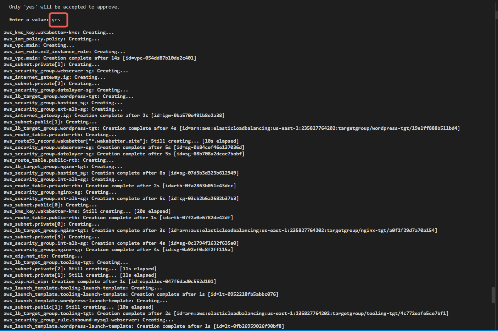
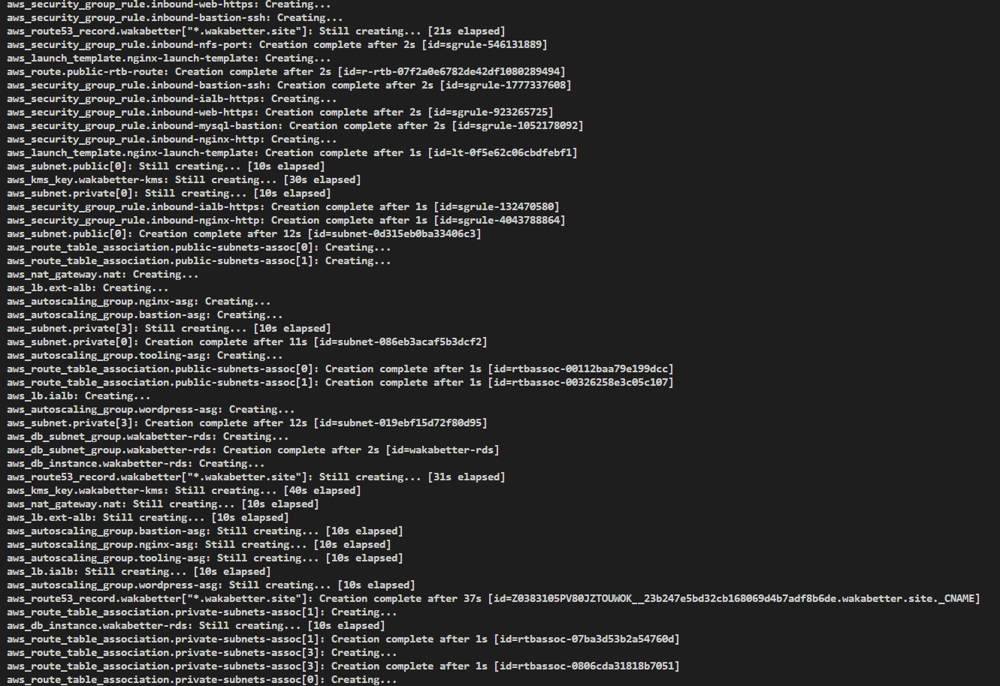
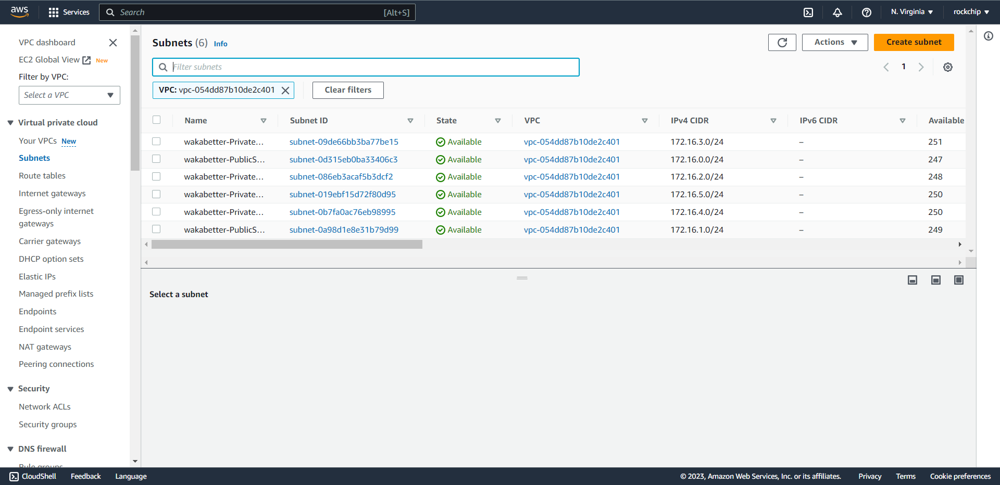
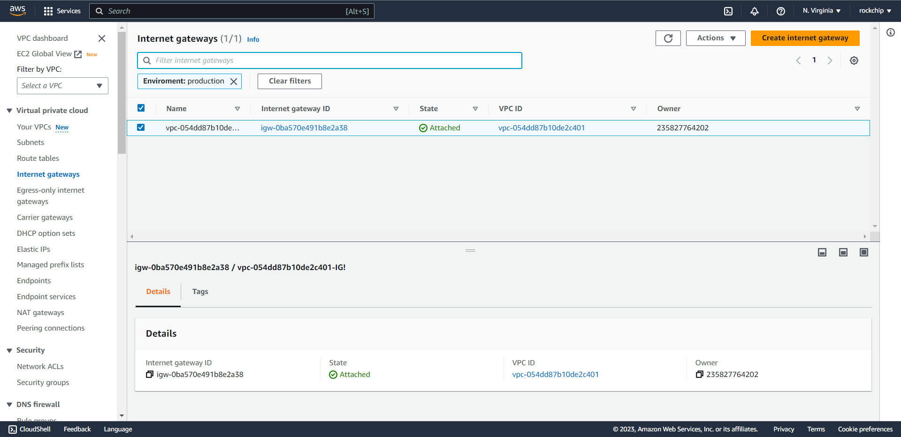
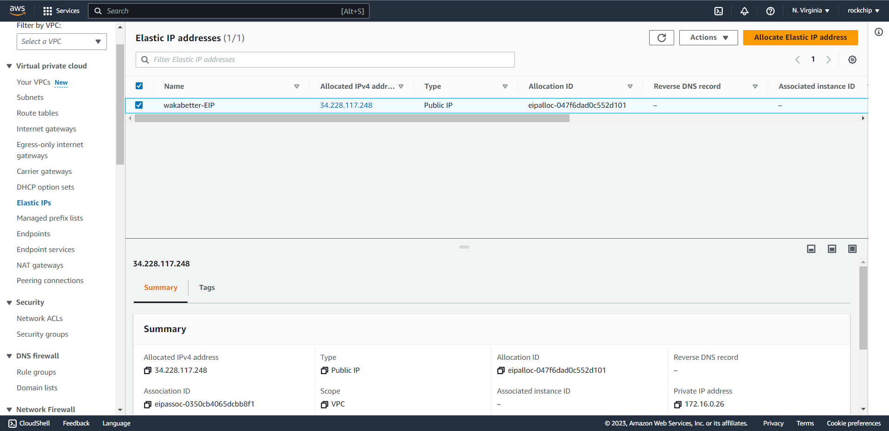
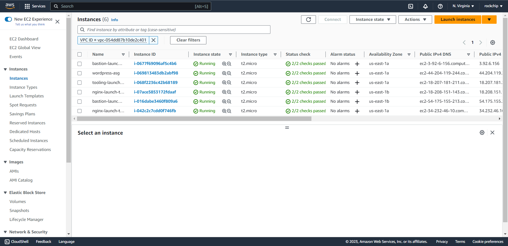
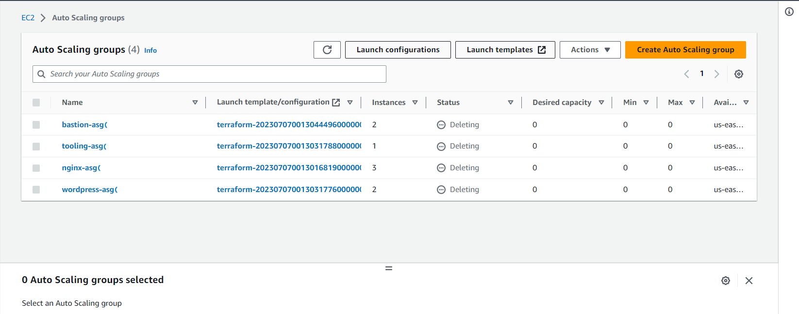


- Don't forget to `terraform destroy` the resources to avoid cost.

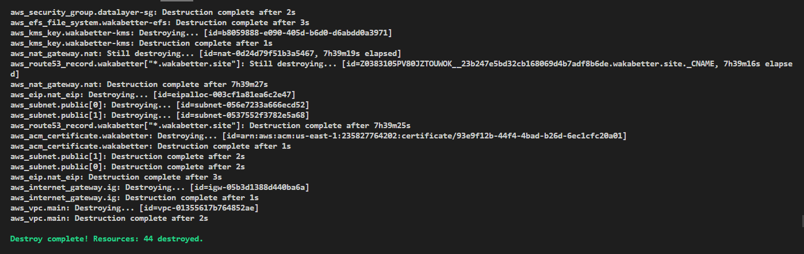