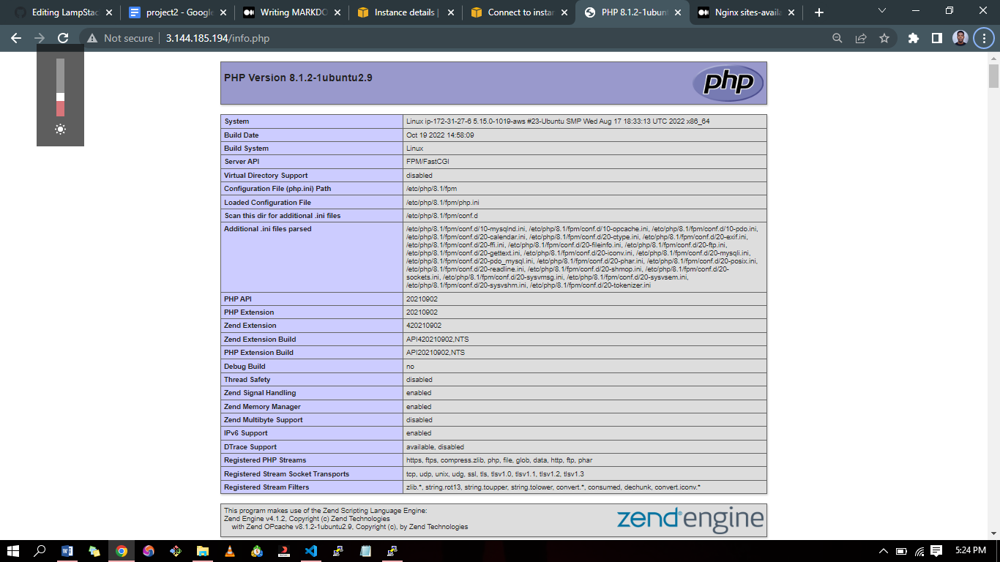
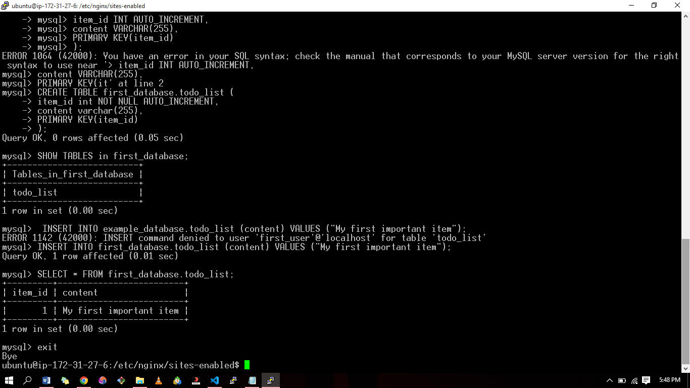
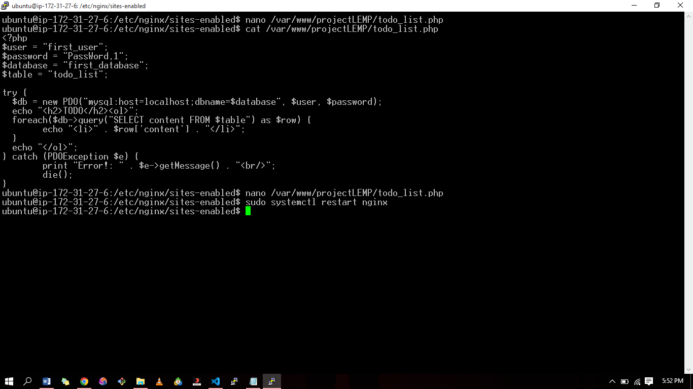
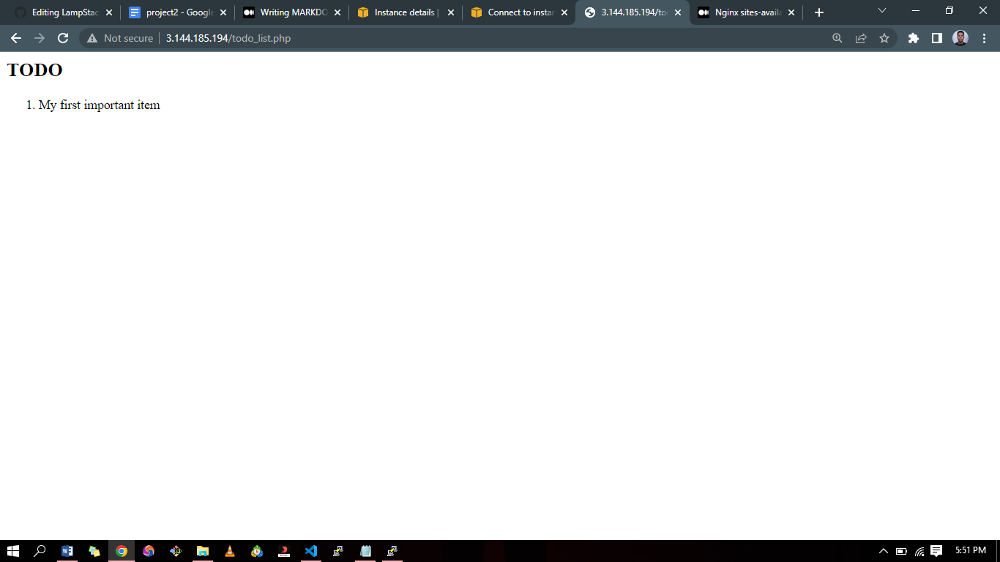

# WEB STACK IMPLEMENTATION LEMP STACK (Linux, NGINX, MySQL and PHP)

## Prerequisites
- Cloud Service Provider - AWS, Azure, GCP, etc.
- Launch a Linux Instance (Ubuntu preferably).
- Priot knowledge on how to SSH into a virtual host.

## STEP 1 – INSTALLING THE NGINX WEB SERVER

In order to display web pages to our site visitors, we are going to employ Nginx, a high-performance web server. We’ll use the `apt` package manager to install this package.
Since this is our first time using `apt` for this session, start off by updating your server’s package index. Following that, you can use `apt install` to get Nginx installed:  
`sudo apt update`

`sudo apt install nginx`

When prompted, enter `Y` to confirm that you want to install Nginx.


To verify that nginx was successfully installed and is running as a service in Ubuntu, run:  
`sudo systemctl status nginx`


If it is green and running, then you did everything correctly.

Open a web browser of your choice and try to access following url  
http://Public-IP-Address:80


## STEP 2 — INSTALLING MYSQL

Again, use `apt` to acquire and install this software:  
`sudo apt install mysql-server`

When prompted, confirm installation by typing `Y`, and then ENTER.


When the installation is finished, log in to the MySQL console by typing:  
`sudo mysql`

Define the users password using this command  
`ALTER USER 'root'@'localhost' IDENTIFIED WITH mysql_native_password BY 'PassWord';`

Exit the MySQL shell with:  
`mysql> exit`

Start the interactive script by running:  
`sudo mysql_secure_installation`

This will ask if you want to configure the VALIDATE PASSWORD PLUGIN.


## STEP 3 – INSTALLING PHP
You have Nginx installed to serve your content and MySQL installed to store and manage your data. Now you can install PHP to process code and generate dynamic content for the web server.
While Apache embeds the PHP interpreter in each request, Nginx requires an external program to handle PHP processing and act as a bridge between the PHP interpreter itself and the web server. This allows for a better overall performance in most PHP-based websites, but it requires additional configuration. You’ll need to install `php-fpm`, which stands for “PHP fastCGI process manager”, and tell Nginx to pass PHP requests to this software for processing. Additionally, you’ll need `php-mysql`, a PHP module that allows PHP to communicate with MySQL-based databases. Core PHP packages will automatically be installed as dependencies.

To install these 2 packages at once, run:  
`sudo apt install php-fpm php-mysql`

When prompted, type `Y` and press ENTER to confirm installation.


You now have your PHP components installed. Next, you will configure Nginx to use them.

## STEP 4 — CONFIGURING NGINX TO USE PHP PROCESSOR

When using the Nginx web server, we can create server blocks (similar to virtual hosts in Apache) to encapsulate configuration details and host more than one domain on a single server.

Create the root web directory for your domain as follows:  
`sudo mkdir /var/www/projectLEMP`

Next, assign ownership of the directory with the $USER environment variable, which will reference your current system user:  
`sudo chown -R $USER:$USER /var/www/projectLEMP`

Create a new configuration file in Nginx’s sites-available directory  
`sudo nano /etc/nginx/sites-available/projectLEMP`

Paste in the following bare-bones configuration:

```php
server {
	listen 80;
	server_name projectLEMP www.projectLEMP;
	root /var/www/projectLEMP;
 
	index index.html index.htm index.php;
 
	location / {
    	try_files $uri $uri/ =404;
	}
 
	location ~ \.php$ {
    	include snippets/fastcgi-php.conf;
    	fastcgi_pass unix:/var/run/php/php8.1-fpm.sock;
 	}
 
	location ~ /\.ht {
    	deny all;
	}
 
}

```


### ***Here’s what each of these directives and location blocks do:***
- listen — Defines what port Nginx will listen on. In this case, it will listen on port 80, the default port for HTTP.

- root — Defines the document root where the files served by this website are stored.

- index — Defines in which order Nginx will prioritize index files for this website. It is a common practice to list index.html files with a higher precedence than index.php files to allow for quickly setting up a maintenance landing page in PHP applications. You can adjust these settings to better suit your application needs.

- server_name — Defines which domain names and/or IP addresses this server block should respond for. Point this directive to your server’s domain name or public IP address.

- location / — The first location block includes a try_files directive, which checks for the existence of files or directories matching a URI request. If Nginx cannot find the appropriate resource, it will return a 404 error.

- location ~ \.php$ — This location block handles the actual PHP processing by pointing Nginx to the fastcgi-php.conf configuration file and the php7.4-fpm.sock file, which declares what socket is associated with php-fpm.

- location ~ /\.ht — The last location block deals with .htaccess files, which Nginx does not process. By adding the deny all directive, if any .htaccess files happen to find their way into the document root, they will not be served to visitors.

Activate your configuration by linking to the config file from Nginx’s sites-enabled directory:  
`sudo ln -s /etc/nginx/sites-available/projectLEMP /etc/nginx/sites-enabled/`

You can test your configuration for syntax errors by typing:  
`sudo nginx -t`

You shall see following message:  


nginx: the configuration file /etc/nginx/nginx.conf syntax is ok
nginx: configuration file /etc/nginx/nginx.conf test is successful

We also need to disable default Nginx host that is currently configured to listen on port 80, for this run:  
`sudo unlink /etc/nginx/sites-enabled/default`

Reload Nginx to apply the changes:  
`sudo systemctl reload nginx`


## STEP 5 – TESTING PHP WITH NGINX
Your LEMP stack should now be completely set up.

You can test it to validate that Nginx can correctly hand .php files off to your PHP processor.  
You can do this by creating a test PHP file in your document root. Open a new file called info.php within your document root in your text editor:  
`sudo nano /var/www/projectLEMP/info.php`

Type or paste the following lines into the new file. This is valid PHP code that will return information about your server:

```php
<?php
phpinfo();
```


You can now access this page in your web browser by visiting the domain name or public IP address you’ve set up in your Nginx configuration file, followed by /info.php:  
http://PublicIPAddress/info.php  
You will see a web page containing detailed information about your server:



After checking the relevant information about your PHP server through that page, it’s best to remove the file you created as it contains sensitive information about your PHP environment and your Ubuntu server. You can use rm to remove that file:  
`sudo rm /var/www/your_domain/info.php`


## STEP 6 – RETRIEVING DATA FROM MYSQL DATABASE WITH PHP

In this step you will create a test database (DB) with simple "To do list" and configure access to it, so the Nginx website would be able to query data from the DB and display it.  
At the time of this writing, the native MySQL PHP library mysqlnd doesn’t support `caching_sha2_authentication`, the default authentication method for MySQL 8. We’ll need to create a new user with the `mysql_native_password authentication method` in order to be able to connect to the MySQL database from PHP.

Create a database named first_database and a user named example_user, but you can replace these names with different values.

First, connect to the MySQL console using the root account:  
`sudo mysql`

To create a new database, run the following command from your MySQL console:  
`mysql> CREATE DATABASE `example_database`;`
Now you can create a new user and grant him full privileges on the database you have just created.

`mysql> CREATE USER 'first_user'@'%' IDENTIFIED WITH mysql_native_password BY 'PassWord.1';`
***NB: REPLACE 'passWord.1' with your preferred 'string'***

Now we need to give this user permission over the first_database database:  
`mysql> GRANT ALL ON first_database.* TO 'first_user'@'%';`


Now exit the MySQL shell with:  
`mysql> exit`


You can test if the new user has the proper permissions by logging in to the MySQL console again, this time using the custom user credentials:  
`mysql -u example_user -p`

`mysql> SHOW DATABASES;`

Next, we’ll create a test table named todo_list. From the MySQL console, run the following statement:

```
CREATE TABLE first_database.todo_list (
mysql> 	item_id int NOT NULL AUTO_INCREMENT,
mysql> 	content varchar(255),
mysql> 	PRIMARY KEY(item_id)
mysql> );
```
Insert a few rows of content in the test table. You might want to repeat the next command a few times, using different VALUES:  
`mysql> INSERT INTO example_database.todo_list (content) VALUES ("My first important item");`

To confirm that the data was successfully saved to your table, run:  
`mysql> SELECT * FROM example_database.todo_list;`

You’ll see the following output:

After confirming that you have valid data in your test table, you can exit the MySQL console:  
`mysql> exit`



Now you can create a PHP script that will connect to MySQL and query for your content. Create a new PHP file in your custom web root directory  
`nano /var/www/projectLEMP/todo_list.php`

***The following PHP script connects to the MySQL database and queries for the content of the todo_list table, displays the results in a list. If there is a problem with the database connection, it will throw an exception.***

Copy this content into your todo_list.php script:

```php
<?php
$user = "example_user";
$password = "password";
$database = "example_database";
$table = "todo_list";
 
try {
  $db = new PDO("mysql:host=localhost;dbname=$database", $user, $password);
  echo "<h2>TODO</h2><ol>";
  foreach($db->query("SELECT content FROM $table") as $row) {
	echo "<li>" . $row['content'] . "</li>";
  }
  echo "</ol>";
} catch (PDOException $e) {
	print "Error!: " . $e->getMessage() . "<br/>";
	die();
}
```

Save and close the file when you are done editing.



You can now access this page in your web browser by visiting the domain name or public IP address configured for your website, followed by /todo_list.php:  
http://Public_domain_or_IP/todo_list.php



You should see a page like this, showing the content you’ve inserted in your test table:  
That means your PHP environment is ready to connect and interact with your MySQL server.
