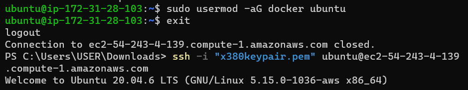

# MIGRATION TO THE СLOUD WITH CONTAINERIZATION. PART 1 – DOCKER & DOCKER COMPOSE

## Install Docker and prepare for migration to the Cloud

First, we need to install `Docker Engine`, which is a client-server application that contains:

- A server with a long-running daemon process dockerd.
- APIs that specify interfaces that programs can use to talk to and instruct the Docker daemon.
- A command-line interface (CLI) client docker.
You can learn how to install `Docker Engine` on your PC [here](https://docs.docker.com/engine/install/).

As a part of this project, you will use already well-known by you Jenkins for Continous Integration (CI). So, when it is time to write Jenkinsfile, update your Terraform code to spin up an EC2 instance for Jenkins and run Ansible to install & configure it.

## MySQL in container
Let us start assembling our application from the Database layer – we will use a pre-built MySQL database container, configure it, and make sure it is ready to receive requests from our PHP application.

### Step 1: Pull MySQL Docker Image from Docker Hub Registry

`docker pull mysql/mysql-server:latest`

**NB: To run Docker commands without having to type sudo every time, you can add your user to the docker group.**
`sudo usermod -aG docker $USER` 
**Replace $USER with your actual user.  Log out and log back in for the changes to take effect.**

List the images to check that you have downloaded them successfully:

`docker image ls`

### Step 2: Deploy the MySQL Container to your Docker Engine

`docker run --name <container_name> -e MYSQL_ROOT_PASSWORD=<my-secret-pw> -d <name_of_image>`

- Replace <container_name> with the name of your choice. If you do not provide a name, Docker will generate a random one.
- The -d option instructs Docker to run the container as a service in the background
- Replace <my-secret-pw> with your chosen password
- In the command above, we used the latest version tag. This tag may differ according to the image you downloaded

check to see if the MySQL container is running using `docker ps -a`

## CONNECTING TO THE MYSQL DOCKER CONTAINER

### Step 3: Connecting to the MySQL Docker Container

We can either connect directly to the container running the MySQL server or use a second container as a MySQL client. Let us see what the first option looks like.

**Approach 1**

- Connecting directly to the container running the MySQL server:

`docker exec -it mysql bash`

or

`docker exec -it <name_of_container> mysql -uroot -p`

Let's break down the command:

`docker exec`: This is the Docker command for executing a command in a running container.

`-it`: These are the same flags we discussed before, used together to make the interaction with the container's command prompt interactive and allocate a pseudo-TTY (terminal).

`mysql-server`: This is the name or ID of the container you want to execute the command in, which is assumed to be a MySQL container.

`mysql -uroot -p`: This part of the command is what you're actually running inside the container. It's invoking the MySQL client and passing arguments to it:

`-uroot`: This specifies the MySQL user you want to connect as. In this case, you're connecting as the "root" user.

`-p`: This tells the MySQL client to prompt for the password.

