# MIGRATION TO THE СLOUD WITH CONTAINERIZATION. PART 1 – DOCKER & DOCKER COMPOSE

## Install Docker and prepare for migration to the Cloud

First, we need to install `Docker Engine`, which is a client-server application that contains:

- A server with a long-running daemon process dockerd.
- APIs that specify interfaces that programs can use to talk to and instruct the Docker daemon.
- A command-line interface (CLI) client docker.
You can learn how to install `Docker Engine` on your PC [here](https://docs.docker.com/engine/install/).


As a part of this project, you will use already well-known by you Jenkins for Continous Integration (CI). So, when it is time to write Jenkinsfile, update your Terraform code to spin up an EC2 instance for Jenkins and run Ansible to install & configure it.

## MySQL in container
Let us start assembling our application from the Database layer – we will use a pre-built MySQL database container, configure it, and make sure it is ready to receive requests from our PHP application.

### Step 1: Pull MySQL Docker Image from Docker Hub Registry

`docker pull mysql/mysql-server:latest`


**NB: To run Docker commands without having to type sudo every time, you can add your user to the docker group.**
`sudo usermod -aG docker $USER` 
**Replace $USER with your actual user.  Log out and log back in for the changes to take effect.**


List the images to check that you have downloaded them successfully:

`docker image ls`


### Step 2: Deploy the MySQL Container to your Docker Engine

`docker run --name <container_name> -e MYSQL_ROOT_PASSWORD=<my-secret-pw> -d <name_of_image>`

- Replace <container_name> with the name of your choice. If you do not provide a name, Docker will generate a random one.
- The -d option instructs Docker to run the container as a service in the background
- Replace <my-secret-pw> with your chosen password
- In the command above, we used the latest version tag. This tag may differ according to the image you downloaded

check to see if the MySQL container is running using `docker ps -a`


## CONNECTING TO THE MYSQL DOCKER CONTAINER

### Step 3: Connecting to the MySQL Docker Container

We can either connect directly to the container running the MySQL server or use a second container as a MySQL client. Let us see what the first option looks like.

**Approach 1**

- Connecting directly to the container running the MySQL server:

`docker exec -it mysql bash`

or

`docker exec -it <name_of_container> <command_to_be_run>`

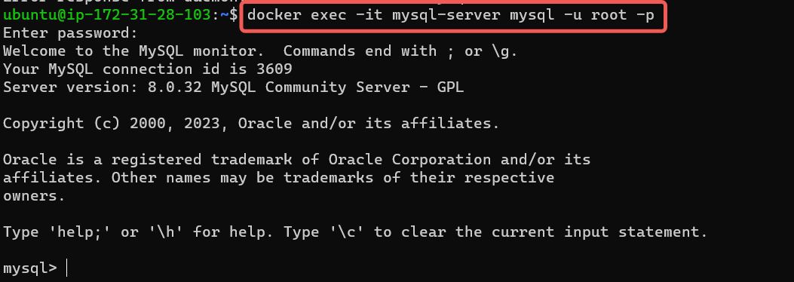

Let's break down the command:

`docker exec`: This is the Docker command for executing a command in a running container.

`-it`: These are the same flags we discussed before, used together to make the interaction with the container's command prompt interactive and allocate a pseudo-TTY (terminal).

`mysql-server`: This is the name or ID of the container you want to execute the command in, which is assumed to be a MySQL container.

`mysql -uroot -p`: This part of the command is what you're actually running inside the container. It's invoking the MySQL client and passing arguments to it:

`-uroot`: This specifies the MySQL user you want to connect as. In this case, you're connecting as the "root" user.

`-p`: This tells the MySQL client to prompt for the password.

stop and remove the previous mysql docker container and verify that the container is deleted
`docker ps -a`
`docker stop mysql-server `
`docker rm mysql or <container ID>`


### Create a network:

`docker network create --subnet=172.18.0.0/24 tooling_app_network`


Creating a custom network is not necessary because even if we do not create a network, Docker will use the default network for all the containers you run. By default, the network we created above is of `DRIVER Bridge`. So, also, it is the default network. You can verify this by running the docker network ls command.


### Run the MySQL Server container using the created network

First, let us create an environment variable to store the root password:

`$ export MYSQL_PW=`
verify the environment variable is created
`echo $MYSQL_PW`

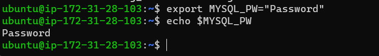

Then, pull the image and run the container, all in one command like below:

`docker run --network tooling_network -h mysqlserverhost --name=mysql-server -e MYSQL_ROOT_PASSWORD=$MYSQL_PW -d mysql/mysql-server:latest`

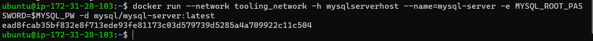

docker run: This is the command to run a Docker container.

--network tooling_app_network: This specifies the network that the container should be connected to. In this case, the container will be connected to a Docker network named tooling_app_network.

-h mysqlserverhost: This option sets the hostname for the container. The hostname is specified as mysqlserverhost.

--name=mysql-server: This assigns a name to the running container, which will be "mysql-server".

-e MYSQL_ROOT_PASSWORD=$MYSQL_PW: This sets an environment variable named MYSQL_ROOT_PASSWORD inside the container. The value of this variable is determined by the shell environment variable $MYSQL_PW.

-d mysql/mysql-server:latest: This specifies the Docker image to use for creating the container. In this case, it pulls the latest version of the mysql/mysql-server image from Docker Hub and runs it in detached mode (-d), meaning the container will run in the background.


Create a file and name it `create_user.sql` and add the below code in the file:

`CREATE USER ''@'%' IDENTIFIED BY '';`
`GRANT ALL PRIVILEGES ON * . * TO ''@'%';`

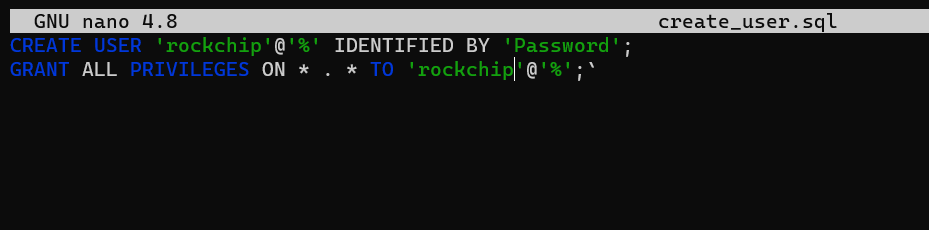

Run the script:

Ensure you are in the directory `create_user.sql` file is located or declare a path

`docker exec -i mysql-server mysql -uroot -p$MYSQL_PW < create_user.sql`

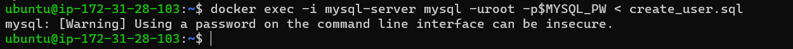

### Connecting to the MySQL server from a second container running the MySQL client utility

The good thing about this approach is that you do not have to install any client tool on your laptop, and you do not need to connect directly to the container running the MySQL server.

Run the MySQL Client Container:

`docker run --network tooling_network --name mysql-client -it --rm mysql mysql -h mysqlserverhost -u -p`

docker run: This is the command to run a Docker container.

--network tooling_app_network: This flag specifies the network to which the container should be connected. In this case, the container will be connected to a network named tooling_app_network.

--name mysql-client: This flag assigns a name to the running container. The name of the container will be set to mysql-client.

-it: These flags combine to allocate a pseudo-TTY and keep the input/output interaction with the container alive. This is typically used when you want to interact with the container's shell or command-line interface.

--rm: This flag tells Docker to remove the container automatically after it exits. This is useful for temporary containers like the MySQL client, which is used for a specific task and then discarded.

mysql: This is the name of the Docker image that will be used to create the container. It refers to an image that contains the MySQL client tools.

mysql -h mysqlserverhost -u -p: This is the command that will be executed inside the container. It runs the MySQL client and provides the following options:

-h mysqlserverhost: This option specifies the hostname (or IP address) of the MySQL server to connect to.
-u: This option is used to provide the MySQL username for authentication. However, there seems to be a missing value after -u, which should be replaced with the actual username you want to use.
-p: This option prompts you to enter the MySQL password for authentication. After entering this option, the MySQL client will wait for you to input the password interactively.

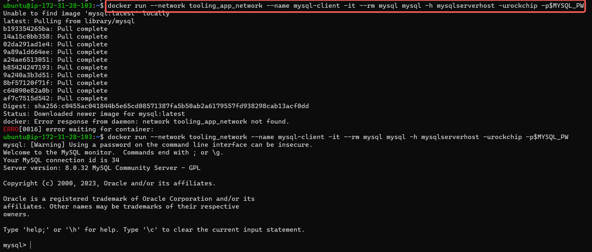

### Prepare database schema

Now you need to prepare a database schema so that the Tooling application can connect to it.

`git clone https://github.com/darey-devops/tooling.git`


On your terminal, export the location of the SQL file

`export tooling_db_schema=/tooling_db_schema.sql`

**You can find the tooling_db_schema.sql in the tooling/html/tooling_db_schema.sql folder of cloned repo.**

Verify that the path is exported

`echo $tooling_db_schema`

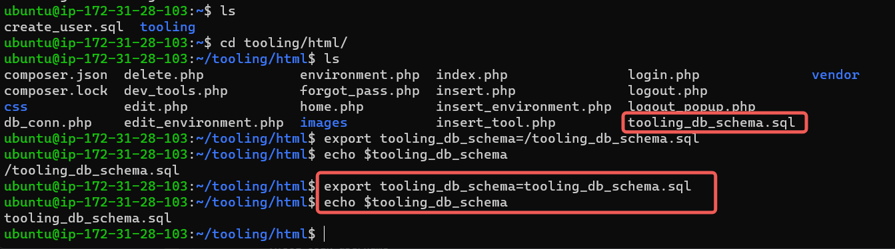

Use the SQL script to create the database and prepare the schema. With the docker exec command

`docker exec -i mysql-server mysql -uroot -p$MYSQL_PW < $tooling_db_schema`

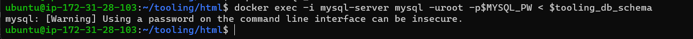

Update the .env file with connection details to the database

**The `.env` file is located in the html tooling/html/.env folder but not visible in terminal.**

`sudo vi .env`

```
MYSQL_IP=mysqlserverhost
MYSQL_USER=username
MYSQL_PASS=client-secrete-password
MYSQL_DBNAME=toolingdb
```

Ensure you are inside the directory "tooling" that has the file Dockerfile and build your container :

`docker build -t tooling:0.0.1 .`

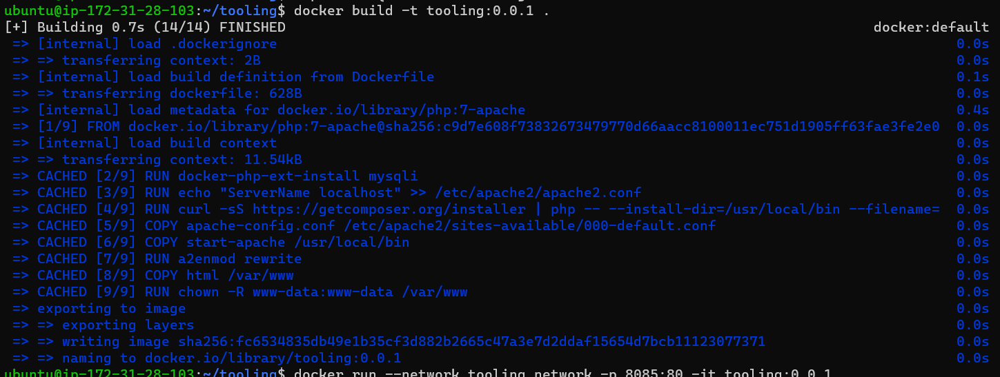

Run the container:
`docker run --network tooling_app_network -p 8085:80 -it tooling:0.0.1`

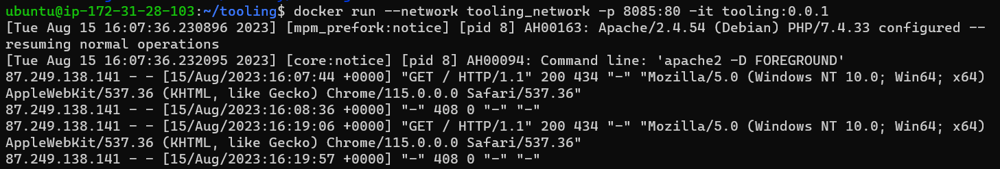

### MAJOR CHALLENGES

Docker image doesn't build with the specified `ENV`

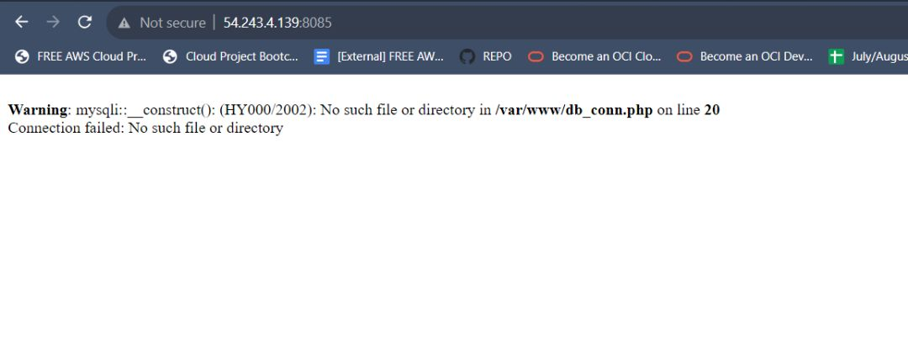

### FIX

`cd tooling/html`

`sudo vi db_conn.php`

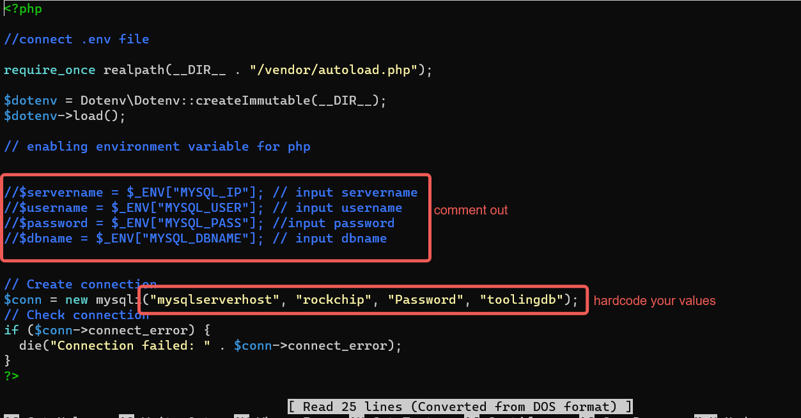


If everything works, you can open the browser and type http://publicIP:8085
You will see the login page.

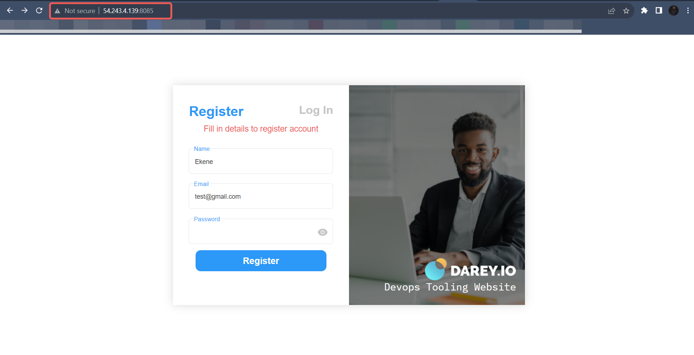

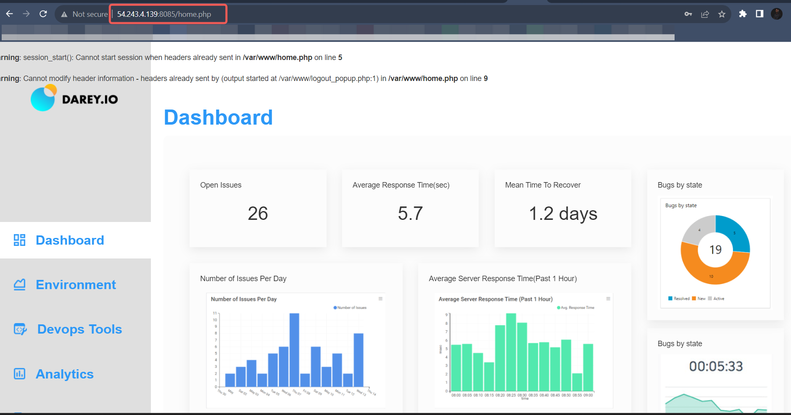